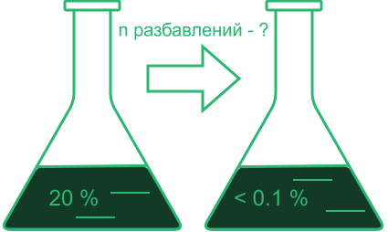
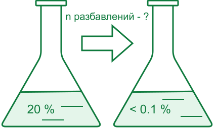
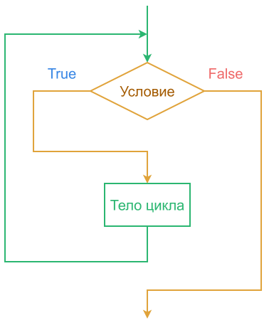
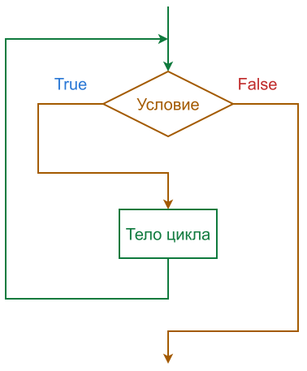

---
# ─────────────────────────────────────────────────────────────────────────────
# HEADMATTER -- шапка лекции. Поля title/lecture/topics попадают в оглавление
# сайта (см. tools/build_site.py), поэтому заполняйте их у каждой лекции.
# ─────────────────────────────────────────────────────────────────────────────
theme: default
title: Операторы цикла в Python
lecture: '03'
topics: while, счётчики и накопители, зацикливание, break, continue, pass, else цикла, for, range, вложенные циклы

# ГЛАВНОЕ ДЛЯ СВЕТЛОЙ/ТЁМНОЙ ТЕМЫ:
#   auto  -- подхватывает системную тему студента, кнопка/клавиша d переключает
#   dark  -- только тёмная (так было раньше)
#   light -- только светлая
colorSchema: auto

# фон титульного слайда: две версии, выбор -- в самом слайде через <LightOrDark>
transition: slide-left
mdc: true
drawings:
  persist: false
duration: 90min

# Заметки докладчика видны только вам (клавиша p -> presenter mode)
---

<div class="cover-bg"></div>

<div class="cover-body flex flex-col justify-center h-full">

<h1>Основы программирования</h1>

<h2 class="!mt-0">Лекция 3. Операторы цикла в Python</h2>

<div class="cover-rule"></div>

###### Лекторы: 

<p class="text-[var(--ink-2)] mt-8">
1. Вячеслав Алексеевич Чузлов<br>
к.т.н., доцент ОХИ ИШПР ТПУ
</p>
<p class="text-[var(--ink-2)] mt-8">
2. Игорь Михайлович Долганов<br>
к.т.н., доцент ОХИ ИШПР ТПУ
</p>

</div>

---

# Задача на разбавление раствора

<div class='cols-2'>

<div>

<LightOrDark>
  <template #dark>
    
  </template>
  <template #light>
    
  </template>
</LightOrDark>

Есть раствор с массовой долей вещества **20 %**.

Разбавляем его **вдвое**: берём половину раствора и доливаем столько же воды.
Массовая доля падает в два раза.

<div class="lead mt-6">
Сколько раз надо повторить разбавление, чтобы массовая доля стала меньше 0,1 %?
</div>

</div>

<div>

<v-click>

<!-- <div class="small-table"> -->

| Разбавление | $\omega, \ \%$ |
|--:|--:|
| 1 | 10 |
| 2 | 5 |
| 3 | 2,5 |
| 4 | 1,25 |
| 5 | 0,625 |
| 6 | 0,3125 |
| 7 | 0,15625 |
| **8** | **0,078125** |

<!-- </div> -->

<div class="warn">
Восемь делений подряд, на середине расчётов очень легко сбиться.
</div>

</v-click>

</div>

</div>

<div class="slide-no">Слайд {{ $nav.currentPage }} / {{ $nav.total }}</div>

---

# Та же задача в шести строках

```python
w = 20.0       # начальная массовая доля, %
n = 0          # счётчик разбавлений
k = 2          # кратность разбавления
w_bound = 0.1  # граничное значение концентрации

while w >= w_bound:
    n += 1
    w = w / k

print('разбавлений:', n, ' стало:', round(w, 6), '%')

```

<div class='output'>разбавлений: 8  стало: 0.078125 %</div>

- Программа не знала заранее, что разбавлений будет восемь. Она **считала до тех пор, пока условие не перестало выполняться**.
- Именно этим цикл отличается от всего, что было в первых двух лекциях: число повторений не записано в коде, оно получается из исходных данных и условий задачи.

<div class="slide-no">Слайд {{ $nav.currentPage }} / {{ $nav.total }}</div>

---

# Данные изменились

Разбавляем не вдвое, а **втрое**. В коде меняется один символ: `k = 2` → `k = 3`.

<div class="lead">
Вдвое потребовалось восемь разбавлений. Сколько потребуется втрое?
</div>

<v-click>

<div class='output'>разбавлений: 5  стало: 0.082305 %</div>

Не «примерно в полтора раза меньше»: зависимость логарифмическая, и на глаз она не берётся. А если разбавлять вдвое до **0,001 %**, понадобится уже **15** разбавлений.

<div class="note">
Сколько раз повторить – мы не знали ни в первом случае, ни во втором. Это посчитала сама программа.
</div>

</v-click>

<div class="slide-no">Слайд {{ $nav.currentPage }} / {{ $nav.total }}</div>

---

# Операторы цикла

- Алгоритмы решения многих задач требуют некоторого количества повторений своих отдельных частей.
- Такие повторяющиеся участки называют циклическими, а операторы языка Python, реализующие соответствующие повторения -- <span style="color: #ffb600;">**операторами цикла**</span>.
- Цикл состоит из <span class='text-[var(--brand)]'>*заголовка цикла*</span> и <span class="text-[var(--accent-warn)]">*тела цикла*</span>.
- Заголовок определяет условие прекращения (или выполнения) цикла, а тело цикла содержит операторы, которые нужно повторять.

Операторы цикла в Python:
1. Цикл `while` -- повторять, **пока выполняется условие**. Число повторений заранее неизвестно.
2. Цикл `for` -- повторять **для каждого элемента** готовой последовательности. Число повторений известно до входа в цикл.

<div class="slide-no">Слайд {{ $nav.currentPage }} / {{ $nav.total }}</div>

---

# Оператор цикла `while`

<div class='cols-2'>

<div>

- Оператор `while` многократно повторяет блок операторов до тех пор, пока проверка в заголовочной части оценивается как истина.
- Управление продолжает возвращаться к началу оператора, пока проверка не даст ложное значение. Когда результат проверки становится ложным, управление переходит на оператор, следующий после блока `while`.
- Если проверка оценивается в ложное значение с самого начала, тогда тело
цикла никогда не выполнится и оператор `while` пропускается. 

</div>

<div>

<LightOrDark>
  <template #dark>
    
  </template>
  <template #light>
    
  </template>
</LightOrDark>

</div>

</div>

<div class="slide-no">Слайд {{ $nav.currentPage }} / {{ $nav.total }}</div>

---

# Оператор цикла `while`

Общий формат цикла `while`:

```python
# псевдокод
while expression:  # Проверка цикла
    operator_1  # Тело цикла
    operator_2
    ...
    operator_n
```

Цикл `while` можно использовать:

- в математических итерационных алгоритмах для проведения вычислений с заданной точностью;
- при вводе данных, когда их количество заранее неизвестно, а условие завершения ввода определено некоторым введенным значением;
- при поиске нужного элемента в какой-либо структуре данных.

<div class="slide-no">Слайд {{ $nav.currentPage }} / {{ $nav.total }}</div>

---

# Четыре части любого цикла

Вернёмся к программе из начала пары. В ней есть четыре смысловые части, и они будут в каждом цикле:

```python
w = 20.0          # 1. ИНИЦИАЛИЗАЦИЯ – то, что готовится ДО входа в цикл
n = 0
k = 2
w_bound = 0.1

while w >= w_bound:   # 2. УСЛОВИЕ – проверяется перед каждым проходом
    n += 1        # 3. ТЕЛО – то, что повторяется
    w = w / k     # 4. ИЗМЕНЕНИЕ – то, из-за чего условие когда-нибудь станет ложным
```

- Части 2 и 3 видны в синтаксисе: это заголовок и отступ. 
- Части 1 и 4 синтаксисом никак не выделены – про них надо помнить самостоятельно.

<div class="slide-no">Слайд {{ $nav.currentPage }} / {{ $nav.total }}</div>

---

# Цикл, который не выполнится ни разу

> Условие проверяется **перед** первым проходом, а не после. Если оно ложно сразу, тело не выполняется вообще:

```python
w = 0.05          # раствор уже разбавлен сильнее, чем нужно
n = 0
k = 2
w_bound = 0.1

while w >= w_bound:   # 0.05 >= 0.1 – False, в цикл не попадаем
    n += 1
    w = w / k

print('разбавлений:', n)
```

<div class='output'>разбавлений: 0</div>

- Ошибки здесь нет: ноль повторений -- законный результат работы цикла.
- Это важно для расчётов: программа, которой «нечего делать», должна спокойно вернуть исходные данные, а не сломаться и не выполнить лишний шаг.

<div class="slide-no">Слайд {{ $nav.currentPage }} / {{ $nav.total }}</div>

---

# Счётчик и накопитель

Два шаблона (паттерна), которые могут часто встречаться:

<div class='cols-2'>

<div>

##### Счётчик -- «сколько раз»

```python
# псевдокод

n = 0            # ДО цикла

while ...:
    ...
    n += 1       # внутри тела
```

Считает проходы, ступени, пробы, промахи.

</div>

<div>

##### Накопитель -- «сколько всего»

```python
# псевдокод

total = 0.0      # ДО цикла

while ...:
    ...
    total += m   # внутри тела
```

Копит сумму масс, объёмов, теплоты.

</div>

</div>

<div class="warn">
И счётчик, и накопитель обнуляются <b>до</b> цикла. Переменная, созданная внутри тела, будет обнуляться на каждом проходе.
</div>

<div class="slide-no">Слайд {{ $nav.currentPage }} / {{ $nav.total }}</div>


---

# Что напечатает эта программа?

```python
x = 5

while x > 0:
    x -= 2
    print(x, end=' ')
```

<v-click>

<div class='output'>3 1 -1</div>

- Первый проход: `5 > 0` истина, `x` становится `3`, печатается **3**.
- Второй: `3 > 0` истина, `x` становится `1`, печатается **1**.
- Третий: `1 > 0` истина, `x` становится `-1`, печатается **−1**. И только теперь `-1 > 0` даёт ложь.

<div class="warn">
Условие проверяется <b>до</b> тела цикла, а печать стоит <b>после</b> изменения. Поэтому отрицательное число всё-таки успевает напечататься. Шаг <code>3</code> «перепрыгнул» ноль – если бы условием было <code>x != 0</code>, цикл не закончился бы никогда.
</div>

</v-click>

<div class="slide-no">Слайд {{ $nav.currentPage }} / {{ $nav.total }}</div>

---

# Ошибка, которая не выводит сообщение

```python
w = 20.0
n = 0

while w >= 0.1:
    n += 1        # увеличиваем счётчик... а условие проверяет w
```

- `w` не меняется никогда, значит `w >= 0.1` истинно всегда. Это **зацикливание**.
- Программа не падает. Красной строки нет. `traceback` не появляется. Курсор просто моргает, и внешне это неотличимо от «долго считает».

<div class="danger">
Это ошибка у которой нет никакого внешнего признака.
</div>

<div class="note">
Часто меняют не ту переменную, которая стоит в условии. Необходимо проверять чтобы  то, что написано в заголовке <code>while</code>, изменялось правильным образом внутри цикла.
</div>

<div class="slide-no">Слайд {{ $nav.currentPage }} / {{ $nav.total }}</div>

---

# Как выйти из бесконечного цикла?

<div class='cols-2'>

<div>

##### Выйти из зациклившейся программы

- Нажать <kbd>Ctrl</kbd> + <kbd>C</kbd> в консоли -- это прерывание выполнения кода.

- В Spyder -- красный квадрат «Stop» на панели консоли.

Перезагружать машину не нужно.

</div>

<div>

##### Подстраховаться заранее

```python
it = 0

while abs(x - x_old) > 1e-9:
    ...
    it += 1
    if it > 1000:
        print('не сошлось')
        break
```

</div>

</div>

<div class='note'>

Счётчик итераций -- это профессиональный подход. Во втором семестре почти весь блок численных методов -- это циклы «повторять, пока не сойдётся», и **расходящийся расчёт там нормальная ситуация**, а не ошибка программиста. Программа обязана уметь сказать «не сошлось» вместо того, чтобы уходить в бесконечный цикл.

</div>

<div class="slide-no">Слайд {{ $nav.currentPage }} / {{ $nav.total }}</div>

---

# Дробные числа в условии цикла

Набираем раствор по каплям 0,1 мл, пока не наберём 25 мл.

<div class='cols-2'>

<div>

##### Так <span class='text-[var(--accent-danger)]'>нельзя</span>

```python
v = 0.0

while v != 25.0:
    v += 0.1
```

Зацикливание навсегда: после 250 прибавлений получается

<div class='output'>25.000000000000085</div>

и `v != 25.0` истинно всегда.

</div>

<div>

##### <span class='text-[var(--brand)]'>Правильный</span> поход

```python
drops = 0
v = 0.0

while drops < 250:
    drops += 1
    v = drops * 0.1

print(v)
```

Считаем **капли** -- целым числом, а объём получаем умножением:

<div class='output'>25.0</div>

</div>

</div>

<div class="warn">
В лекции 2 мы говорили, что дробные числа нельзя сравнивать через <code>==</code> и <code>!=</code>. В <code>if</code> ценой ошибки была неверная ветка. В <code>while</code> цена другая – зависшая программа.
</div>

<div class="slide-no">Слайд {{ $nav.currentPage }} / {{ $nav.total }}</div>

---

# Условие -- не обязательно сравнение

Алгоритм Евклида: наибольший общий делитель двух чисел.

<div class='cols-2'>

<div>

```python
a = 1071
b = 462

while b:
    tmp = b
    b = a % b
    a = tmp
    print(a, b)

print(a)
```

</div>

<div>

<div class='output'>
462 147 <br>
147 21 <br>
21 0 <br>
21
</div>

</div>

</div>

> В заголовке стоит не сравнение, а просто переменная. Из лекции 2: **ноль -- это `False`, любое другое число -- `True`**, поэтому `while b:` означает `while b != 0:`.

<div class="slide-no">Слайд {{ $nav.currentPage }} / {{ $nav.total }}</div>

---
layout: image-right
class: flex flex-col items-center justify-center
image: /pics/photo_2026-02-19_14-52-25.jpg
---

# Оператор `break`

---

# Оператор `break`

> Оператор `break` немедленно завершает выполнение цикла `while` или `for`, то есть останавливает выполнение команд, даже если условие входа ещё не приняло значение `False` или последовательность элементов не закончилась.

```python
while True:
    name = input('Enter name: ')

    if name == 'stop':
        break

    print('Hello', name)

print('Goodbye')
```

<div class='output'>
Enter name: John <br>
Hello John <br>
Enter name: Julia <br>
Hello Julia <br>
Enter name: stop <br>
Goodbye
</div>

<div class="slide-no">Слайд {{ $nav.currentPage }} / {{ $nav.total }}</div>

---

# `break`: поиск первого подходящего

Задача: найти первый алкан с молярной массой выше 100 г/моль.

```python
M_C = 12.011 
M_H = 1.008
n = 1

while True:
    M = n * M_C + (2 * n + 2) * M_H
    if M > 100:
        break
    n += 1

print(f'первый алкан тяжелее 100 г/моль: C{n}H{2 * n + 2}, M = {M:.2f}')
```

<div class='output'>первый алкан тяжелее 100 г/моль: C7H16, M = 100.20</div>

- Это типовая форма поиска: идём по вариантам и выходим, как только нашли.
- `break` выходит **только из ближайшего цикла**, внутри которого он написан.

<div class="slide-no">Слайд {{ $nav.currentPage }} / {{ $nav.total }}</div>

---

# Предпроверка и постпроверка

В обоих последних примерах заголовок цикла ничего не проверял, а настоящая проверка стояла в конце тела. Это известная конструкция -- **цикл с постпроверкой условия**.

<div class='cols-2'>

<div>

##### С предпроверкой

Условие проверяется **до** тела цикла. Тело может не выполниться ни разу.

```python
v = -5

while v > 0:
    print('тело цикла')
    v -= 1
```

<div class='output'> 
<br>
</div>

Не напечаталось ничего.

</div>

<div>

##### С постпроверкой

Условие проверяется **после** тела цикла. Тело выполняется **хотя бы один раз**.

| Язык | Запись |
|---|---|
| Pascal | `repeat ... until` |
| C, C++, Java | `do { ... } while (...)` |
| Python | **отдельной конструкции нет** |

</div>

</div>

<div class="note">
Постпроверка нужна там, где результат действия заранее неизвестен: ввод данных, показание прибора, очередная попытка. «Сделать, потом посмотреть, нужно ли повторять».
</div>

<div class="slide-no">Слайд {{ $nav.currentPage }} / {{ $nav.total }}</div>

---

# `repeat ... until` на языке Python

Отдельной конструкции нет, но можно собрать из бесконечного `while` и `break`.

```python
while True:            # заголовок ничего не проверяет
    s = input('объём пробы, мл: ')
    v = float(s)

    if v > 0:          # ПРОВЕРКА ПЕРЕНЕСЕНА ВНИЗ – это и есть until
        break

    print('объём должен быть положительным, повторите')

print('принято:', v)
```

<div class='output'>
объём пробы, мл: -5 <br>
объём должен быть положительным, повторите <br>
объём пробы, мл: 0 <br>
объём должен быть положительным, повторите <br>
объём пробы, мл: 12.5 <br>
принято: 12.5
</div>

<div class="warn">
Если в коде есть <code>while True</code> – обязательно должен быть <code>break</code>. Иначе – бесконечный цикл.
</div>

<div class="slide-no">Слайд {{ $nav.currentPage }} / {{ $nav.total }}</div>


---

# Серия навесок

Взвешиваем пробы одну за другой. Сколько их будет -- заранее неизвестно:

```python
total = 0.0
count = 0

while True:
    s = input('масса навески, г (Enter – закончить): ')
    if s == '':
        break
    total += float(s)
    count += 1

print('навесок:', count)
print('сумма:  ', round(total, 3), 'г')
print('средняя:', round(total / count, 4), 'г')
```

<div class='output'>
навесок: 3 <br>
сумма:   37.32 г <br>
средняя: 12.44 г
</div>

<div class="slide-no">Слайд {{ $nav.currentPage }} / {{ $nav.total }}</div>


---
layout: image-right
class: flex flex-col items-center justify-center
image: /pics/photo_2026-02-19_14-52-25.jpg
---

# Операторы `continue`, `pass`. Конструкция `else` цикла


---

# Оператор `continue`

> Оператор `continue` действует подобно `break`, но вместо немедленного выхода из содержащего его цикла он немедленно начинает новую итерацию этого цикла без завершения блока инструкций для текущей итерации.

Необходимо вывести на экран все целые чётные числа от 0 до 10 в обратном порядке.

<div class='cols-2'>

<div>

##### С оператором `continue`

```python
x = 11

while x:
    x -= 1
    
    if x % 2:  # Нечётное? Тогда пропускаем.
        continue
    
    print(x, end=' ')
```
<div class='output'>10 8 6 4 2 0</div>

</div>

<div>

##### Альтернативный вариант

```python
x = 11

while x:
    x -= 1
    
    if not x % 2:  # Чётное? Тогда выводим.
        print(x, end=' ')


```

<div class='output'>10 8 6 4 2 0</div>

</div>

</div>

<div class="note">
Оператор <code>continue</code> полезен, когда текущую итерацию цикла нужно <b>досрочно завершить и перейти к следующей</b>, не выполняя оставшийся код внутри цикла.
</div>

<div class="slide-no">Слайд {{ $nav.currentPage }} / {{ $nav.total }}</div>

---

# Оператор `pass`

- Оператор `pass` -- это заполнитель, обозначающий отсутствие действий, используемый в ситуациях, когда синтаксис требует оператора, но нет возможности выполнить что-либо полезное.
- Данный оператор часто применяется для кодирования пустого тела для составного оператора.

Настоящее применение -- **заготовка**: программа пишется сверху вниз, и `pass` позволяет запустить её, пока какая-то ветка ещё не написана.

```python
while w >= target:
    w = w / k
    n += 1

    if n > 100:
        pass  # TODO: сообщить, что разбавлять придётся слишком долго
```

- Без `pass` этот код не запустится вовсе: после `if` обязано стоять хотя бы одно действие, и пустой блок -- синтаксическая ошибка.
- С `pass` программа работает целиком, а недописанное место остаётся видимым.


<div class="slide-no">Слайд {{ $nav.currentPage }} / {{ $nav.total }}</div>

---

# Конструкция `else` цикла

> У цикла `while` бывает ветка `else` -- и она значит совсем не то, что `else` у `if`.

<div class='cols-2'>

<div>

```python
# псевдокод
while condition():
    operators

    # Выход с пропуском else
    if exit_test():
        break

    # Переход к заголовку цикла
    if skip_test():
        continue

# Выполняется, если НЕ было break
else:
    operators
```

</div>

<div>


1. `else` выполняется, когда цикл **закончился сам** (условие стало ложным).
2. `break` ветку `else` **пропускает**.
3. `continue` на `else` не влияет никак.

</div>


</div>

<div class="note">
В сообществе Python это ключевое слово давно предлагают называть <code>nobreak</code>. Читайте его именно так: <b>«если не было <code>break</code>»</b>.
</div>

<div class="slide-no">Слайд {{ $nav.currentPage }} / {{ $nav.total }}</div>

---

# Конструкция `else` цикла

Проверка, является ли положительное целое число `y` простым, поиском сомножителей больше $1$:

```python
y = 91
x = y // 2  # Для y > 1

while x > 1:
    if not y % x:  # Остаток от деления
        print(y, 'has factor', x)  # Имеет сомножитель
        break  # Пропуск else

    x -= 1

else:  # Нормальный выход
    print(y, 'is prime')  # Является простым
```

<div class='output'>91 has factor 13</div>

При `y = 97` сомножитель не найдётся, цикл дойдёт до конца сам, и сработает `else`:

<div class='output'>97 is prime</div>

<div class="slide-no">Слайд {{ $nav.currentPage }} / {{ $nav.total }}</div>

---

# Сработает ли здесь `else`?

```python
n = 0

while n < 4:
    n += 1
    if n > 10:
        break
else:
    print('else сработал')
```

<v-click>

<div class='output'>else сработал</div>

- `n` растёт от 1 до 4, условие `n > 10` не выполняется ни разу, значит `break` **не сработал**.
- Цикл закончился сам -- условие `n < 4` стало ложным. Это и есть «нормальный выход», после которого выполняется `else`.

<div class="warn">

Может показаться, «раз ничего не нашли, то и печатать нечего», но это неверно. 

<code>else</code> смотрит не на результат поиска, а <b>только на то, был ли <code>break</code></b>.

</div>

</v-click>

<div class="slide-no">Слайд {{ $nav.currentPage }} / {{ $nav.total }}</div>

---
layout: image-right
class: flex flex-col items-center justify-center
image: /pics/photo_2026-02-19_14-52-25.jpg
---

# Цикл `for`

---

# Оператор цикла `for`

- Оператор `for` ... `in` также является оператором цикла, который осуществляет итерацию по <span class="text-[var(--accent-warn)]">*итерируемому объекту*</span>, т.е. проходит через каждый его элемент по очереди.
- Итерируемым бывает `range()`, строка, а дальше в курсе -- список, словарь, множество. Переменная в заголовке на каждом проходе получает очередной элемент.
- Во многих случаях в заголовке цикла `for` используется функция `range()`, которая является генератором арифметических прогрессий:

```python
for i in range(10):  # 10 не включительно
    print(i, end=' ')
```

<div class='output'>0 1 2 3 4 5 6 7 8 9</div>

```python
for symbol in 'CHON':  # строка – тоже последовательность
    print(symbol, end=' ')
```

<div class='output'>C H O N</div>

<div class="note">
главное отличие от <code>while</code>: число проходов определено <b>до</b> входа в цикл. Зациклиться в <code>for</code> нельзя.
</div>

<div class="slide-no">Слайд {{ $nav.currentPage }} / {{ $nav.total }}</div>

---

# `range()` во всех формах

<!-- <div class="small-table"> -->

| Запись | Что даёт | Проходов |
|---|---|--:|
| `range(5)` | 0 1 2 3 4 | 5 |
| `range(1, 6)` | 1 2 3 4 5 | 5 |
| `range(0, 11, 2)` | 0 2 4 6 8 10 | 6 |
| `range(10, 0, -2)` | 10 8 6 4 2 | 5 |
| `range(5, 5)` | -- | **0** |
| `range(5, 1)` | -- | **0** |

<!-- </div> -->

- Правый конец **не включается**. Причина: `range(n)` даёт  `n` значений, а `len(range(a, b))` <br> равно `b - a`. Дальше на этом будет держаться индексация списков.
- Две последние строки: `range()`, у которого начало не меньше конца -- **не ошибка**. Это пустая последовательность, и цикл просто не выполнится ни разу.


<div class="slide-no">Слайд {{ $nav.currentPage }} / {{ $nav.total }}</div>

---

# `range()` не принимает дробный шаг

Нужна таблица от 20 до 22 °C с шагом 0,5. Естественная запись не работает:

```python
for t in range(20, 22, 0.5):
    print(t)
```

<div class='output'>TypeError: 'float' object cannot be interpreted as an integer</div>

Правильный приём -- **считать целыми, а дробное получать умножением**:

```python
for i in range(5):
    t = 20 + i * 0.5
    print(t, end='  ')
```

<div class='output'>20.0  20.5  21.0  21.5  22.0</div>

<div class="note">
Это тот же приём, что был на слайде про капли: шаг считаем целым числом, величину получаем умножением. Так не накапливается погрешность, о которой была лекция 2.
</div>

<div class="slide-no">Слайд {{ $nav.currentPage }} / {{ $nav.total }}</div>

---

# Таблица, ради которой нужен `for`

Молярная масса и массовая доля углерода для гомологического ряда алканов $C_nH_{2n+2}$:

<div class='cols-2'>

<div>

```python
M_C, M_H = 12.011, 1.008

for n in range(1, 11):
    M = n * M_C + (2 * n + 2) * M_H
    w = M_C * n / M * 100
    print(f'C{n:<2} H{2 * n + 2:<2}   '
          f'M = {M:6.2f}   w(C) = {w:5.2f} %')
```

<div class='output'>
C1  H4    M =  16.04   w(C) = 74.87 % <br>
C2  H6    M =  30.07   w(C) = 79.89 % <br>
C3  H8    M =  44.10   w(C) = 81.71 % <br>
C4  H10   M =  58.12   w(C) = 82.66 % <br>
C5  H12   M =  72.15   w(C) = 83.24 % <br>
C6  H14   M =  86.18   w(C) = 83.62 % <br>
C7  H16   M = 100.20   w(C) = 83.90 % <br>
C8  H18   M = 114.23   w(C) = 84.12 % <br>
C9  H20   M = 128.26   w(C) = 84.28 % <br>
C10 H22   M = 142.29   w(C) = 84.41 %
</div>

</div>

<div>

- Двадцать одинаковых расчётов руками -- это полчаса. 
- Здесь это четыре строки, и число строк не зависит от того, до $C_{10}$ считать или до $C_{100}$.

</div>

</div>

<div class="slide-no">Слайд {{ $nav.currentPage }} / {{ $nav.total }}</div>

---

# Вложенные циклы `for`

Операторы цикла `for` могут быть вложены друг в друга на произвольную глубину:

```python
for i in range(3):
    for j in range(3):
        if i != j:
            print(i, j, round(1 / (i + j), 2))
```

<div class='output'>
0 1 1.0 <br>
0 2 0.5 <br>
1 0 1.0 <br>
1 2 0.33 <br>
2 0 0.5 <br>
2 1 0.33 <br>
</div>

На каждое значение внешней переменной внутренний цикл проходит **целиком**. Три прохода снаружи по три внутри -- девять пар, из которых три отсеяны условием.

<div class="slide-no">Слайд {{ $nav.currentPage }} / {{ $nav.total }}</div>

---

# Зачем вкладывать циклы

Вложенный цикл -- это «повторить целый расчёт для каждого набора данных». Вернёмся к задаче из начала пары и посчитаем её сразу двенадцать раз:

<div class='cols-2'>

<div>

```python
print(f'{"кратность":>9}{"до 1 %":>10}'
      f'{"до 0,1 %":>10}{"до 0,01 %":>10}')

for k in (2, 3, 5, 10):          # во сколько раз разбавляем
    print(f'{k:>9}', end='')

    for target in (1.0, 0.1, 0.01):   # до какой доли
        w, n = 20.0, 0

        while w >= target:            # сам расчёт
            w /= k
            n += 1

        print(f'{n:>10}', end='')
    print()
```

</div>

<div>

<div class='output'>
кратность    до 1 %  до 0,1 % до 0,01 % <br>
        2         5         8        11 <br>
        3         3         5         7 <br>
        5         2         4         5 <br>
       10         2         3         4
</div>

Вкладывать можно **разные** циклы: здесь `while` работает внутри двух `for`.

Восьмёрка во второй строке -- тот самый ответ, который в начале пары считали на калькуляторе.

</div>

</div>

<div class="slide-no">Слайд {{ $nav.currentPage }} / {{ $nav.total }}</div>

---

# `break` выходит только из своего цикла

```python
for i in range(3):
    for j in range(3):
        if j == 1:
            break          # выходит ТОЛЬКО из внутреннего цикла
        print(i, j, end='  ')
```

<div class='output'>0 0  1 0  2 0</div>

- Внутренний цикл обрывается на `j == 1` -- поэтому из каждой тройки печатается только `j = 0`.
- А внешний отрабатывает **все три раза**: `break` про него ничего не знает.


<div class="note">

Выйти сразу из двух циклов можно через переменную-флаг, а по-настоящему удобно – вынеся внутренний цикл в функцию и написав <code>return</code>.

</div>

<div class="slide-no">Слайд {{ $nav.currentPage }} / {{ $nav.total }}</div>

---

# Конструкция `else` у цикла `for`

Устроено так же, как у `while`, и применяется чаще всего именно здесь: ищем первый алкан тяжелее 100 г/моль, но перебираем не бесконечно, а только ряд до C₂₀.

```python
M_C, M_H = 12.011, 1.008

for n in range(1, 21):
    M = n * M_C + (2 * n + 2) * M_H
    if M > 100:
        print(f'первый: C{n}H{2 * n + 2}, M = {M:.2f}')
        break
else:
    print('в ряду до C20 такого нет')
```

<div class='output'>первый: C7H16, M = 100.20</div>

Поменяем порог на 1000 -- `break` не выполнится ни разу, цикл дойдёт до конца, и сработает `else`:

<div class='output'>в ряду до C20 такого нет</div>

<div class="note">
Без <code>else</code> для этого пришлось бы заводить переменную-флаг «нашли ли».
</div>

<div class="slide-no">Слайд {{ $nav.currentPage }} / {{ $nav.total }}</div>

---

# Сколько итераций выполнится в цикле?

```python
for i in range(1, 10, 3):
    print(i, end=' ')
```

<v-click>

<div class='output'>1 4 7</div>

**Три прохода.** Отсчёт идёт от `1` с шагом `3`: следующее значение `10` уже не меньше правой границы, поэтому в цикл не попадает.


- Ответ «4» получается, если посчитать, что правая граница включается.

<div class="note">
проверять себя удобно так: <code>len(range(1, 10, 3))</code> печатает длину, не запуская цикл.
</div>

</v-click>

<div class="slide-no">Слайд {{ $nav.currentPage }} / {{ $nav.total }}</div>

---

# Какой цикл выбрать

<!-- <div class="small-table"> -->

| Что известно о задаче | Что писать |
|---|---|
| Число повторений известно заранее | `for i in range(n)` |
| Идём по готовым данным: строке, списку, файлу | `for x in данные` |
| Повторять, пока выполняется условие | `while условие` |
| Цикл должен выполниться хотя бы один раз | `while True` + `break` |
| Условие есть, но сходимость не гарантирована | `while` + счётчик-предохранитель |

<!-- </div> -->

Ключевой вопрос: **известно ли заранее число повторений цикла.** Известно -- `for`, неизвестно -- `while`.

<div class="note">

Любую задачу можно решить и тем и иным циклом -- но программа, написанная «не тем», читается заметно хуже. Счётчик, который заводится и увеличивается вручную при известном числе шагов -- признак того, что нужен был <code>for</code>.

</div>

<div class="slide-no">Слайд {{ $nav.currentPage }} / {{ $nav.total }}</div>

---

# Частые ошибки

<ol class="steps">
<li><b>Переменная из условия не меняется в теле.</b> Зацикливание, сообщения об ошибке не будет. Выход <kbd>Ctrl</kbd> + <kbd>C</kbd>.</li>
<li><b>Тело цикла не под отступом.</b> Синтаксически верно, поэтому программа запустится и выполнит эту строку один раз после цикла, а не на каждом проходе.</li>
<li><b>Перепутаны <code>&gt;</code> и <code>&gt;=</code>.</b> Цикл делает на один проход больше или меньше. Проверяется всегда одинаково: посчитайте руками первый и последний проход.</li>
<li><b>Изменение переменной цикла внутри <code>for</code>.</b> Ни на что не влияет – последовательность уже построена, и следующее значение берётся из неё.</li>
</ol>

```python
for i in range(5):
    print(i, end=' ')
    i += 10        # на ход цикла не влияет
```

<div class='output'>0 1 2 3 4</div>

<div class="slide-no">Слайд {{ $nav.currentPage }} / {{ $nav.total }}</div>

---
layout: image-left
image: /pics/photo_2025-11-10_15-42-35.jpg
class: flex flex-col items-center justify-center
---

<LightOrDark>
  <template #dark>
    
  </template>
  <template #light>
    
  </template>
</LightOrDark>

<br><br><br>

# Благодарю за внимание!
