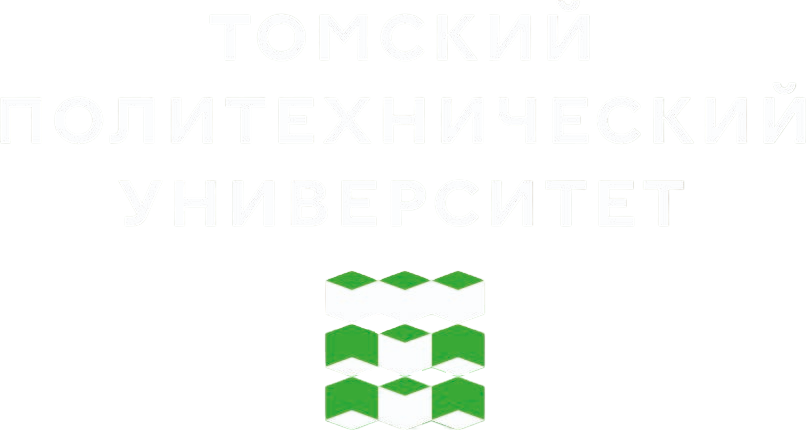

---
# ─────────────────────────────────────────────────────────────────────────────
# HEADMATTER -- шапка лекции. Поля title/lecture/topics попадают в оглавление
# сайта (см. tools/build_site.py), поэтому заполняйте их у каждой лекции.
# ─────────────────────────────────────────────────────────────────────────────
routerMode: hash
theme: default
title: Последовательности в Python. Строки
lecture: '04'
topics: последовательности, строки, специальные символы, in, индексы, срезы, неизменяемость, методы строк, split и join, format() и f-строки

# ГЛАВНОЕ ДЛЯ СВЕТЛОЙ/ТЁМНОЙ ТЕМЫ:
#   auto  -- подхватывает системную тему студента, кнопка/клавиша d переключает
#   dark  -- только тёмная (так было раньше)
#   light -- только светлая
colorSchema: auto

# фон титульного слайда: две версии, выбор -- в самом слайде через <LightOrDark>
transition: slide-left
mdc: true
drawings:
  persist: false
duration: 90min

# Заметки докладчика видны только вам (клавиша p -> presenter mode)
---

<div class="cover-bg"></div>

<div class="cover-body flex flex-col justify-center h-full">

<h1>Основы программирования</h1>

<h2 class="!mt-0">Лекция 4. Последовательности в Python: строки (str)</h2>

<div class="cover-rule"></div>

###### Лекторы: 

<p class="text-[var(--ink-2)] mt-8">
1. Вячеслав Алексеевич Чузлов<br>
к.т.н., доцент ОХИ ИШПР ТПУ
</p>
<p class="text-[var(--ink-2)] mt-8">
2. Игорь Михайлович Долганов<br>
к.т.н., доцент ОХИ ИШПР ТПУ
</p>

</div>


---

# Последовательности в Python

> Строки, списки и кортежи иногда объединяют под общим понятием **последовательность**.
> Помимо последовательностей существует также понятие **итерируемого** **объекта**.

<span style="color: #ffb600;">**Итерируемый** **объект** (iterable)</span> - это коллекция объектов, в которой можно получить каждый элемент по очереди. Поэтому любая последовательность является итерируемой. Например список - это итерируемый объект.
> Итерируемый объект может не быть последовательностью - множество является итерируемым объектом, но не является последовательностью.

Объекты, относящиеся к последовательностям, имеют общие операции:

<div class="cols-2">

<div>

1. Взятие длины последовательности (`len()`)
2. Проверка вхождения элемента в последовательность (`in`)
3. Поиск индекса элемента в последовательности (`index()`)

</div>

<div>

4. Операция взятия среза
5. Максимальный и минимальный элементы
6. Конкатенация (объединение)
7. Повторение последовательности
8. Сравнение последовательностей

</div>

</div>

<div class="slide-no">Слайд {{ $nav.currentPage }} / {{ $nav.total }}</div>

---
layout: image-right
class: flex flex-col items-center justify-center
image: /pics/photo_2026-02-19_14-53-38.jpg
---

# Строки (`str`)

---

# Строки (`str`)

> В Python объект, представляющий строку (тип `str`), – это *упорядоченная неизменяемая последовательность* символов.

Несколько возможных способов записи строк в Python-коде:

- одинарные кавычки – `'spa"m'`
- двойные кавычки – `"spa'm"`
- тройные кавычки – `"""... spam ..."""` - для многострочного текста и документации функций, методов и классов
- неформатированные строки – `r'C:\new\test.spm'`
- форматированные строки (f-строки) - `f'Height is {x:4.2f}; Width is {y:4.2f}; Area is {x * y:4.2f}'`.

Для определения переменной, содержащей постоянный текст (строковый литерал – string literal), необходимо взять этот текст в одиночные или двойные кавычки:

```python
greeting = 'Hello, Sir!'
bye = "Adiós"
```

<div class="slide-no">Слайд {{ $nav.currentPage }} / {{ $nav.total }}</div>

---

# Специальные символы в строках

Обратная косая черта `\` внутри строки начинает <span class="text-[var(--brand)]">*escape-последовательность*</span>: два знака в коде дают один специальный символ.

<div class='cols-2'>

<div>

| Запись | Символ |
|---|---|
| `\n` | перевод строки |
| `\t` | табуляция |
| `\\` | обратная косая черта |
| `\'` и `\"` | кавычка внутри строки |

</div>

<div>

```python
print('Проба\tpH\n1\t6.85\n2\t7.10')
print(len('\n'))
print('It\'s H2O')
```

<pre class="output">Проба	pH
1	6.85
2	7.10
1
It's H2O</pre>

</div>

</div>

<div class="note">
<code>len('\n')</code> равно 1: в коде два знака, а в строке один символ.
</div>

<div class="slide-no">Слайд {{ $nav.currentPage }} / {{ $nav.total }}</div>

---

# Табуляция `\t`

Табуляция переносит следующий за ней текст к ближайшей **позиции табуляции**. В консоли они обычно стоят через каждые 8 символов: 0, 8, 16... Поэтому текст после `\t` начинается с одной позиции, даже если слова перед ним разной длины.

```python
print('Проба\tpH\n1\t6.85\nконтроль\t7.00')
```

<div class="tabs">
<b class="stop">0</b><b>1</b><b>2</b><b>3</b><b>4</b><b>5</b><b>6</b><b>7</b><b class="stop">8</b><b>9</b><b>10</b><b>11</b><b>12</b><b>13</b><b>14</b><b>15</b><b class="stop">16</b><b>17</b><b>18</b><b>19</b>
<span class="nl">П</span><span>р</span><span>о</span><span>б</span><span>а</span><span class="t sp3"><em>\t</em>→</span><span>p</span><span>H</span>
<span class="nl">1</span><span class="t sp7"><em>\t</em>→</span><span>6</span><span>.</span><span>8</span><span>5</span>
<span class="nl">к</span><span>о</span><span>н</span><span>т</span><span>р</span><span>о</span><span>л</span><span>ь</span><span class="t sp8"><em>\t</em>→</span><span>7</span><span>.</span><span>0</span><span>0</span>
</div>

- `\t` -- это один символ, но на экране он занимает от 1 до 8 позиций: столько, сколько осталось до следующей позиции табуляции.
- В третьей строке слово «контроль» заняло все 8 позиций, и табуляция перенесла значение к позиции 16. Столбец разъехался.

<div class="note">
Надёжнее выравнивать столбцы, задавая их ширину в f-строке: об этом в конце пары.
</div>

<div class="slide-no">Слайд {{ $nav.currentPage }} / {{ $nav.total }}</div>

<!--
Название пришло от клавиши Tab пишущей машинки: ею перескакивали к заранее выставленным упорам, когда печатали таблицы.
-->

---

# Путь к файлу в Windows

```python
path = 'C:\new\test.txt'
print(path)
```

<pre class="output">C:
ew	est.txt</pre>

Сообщения об ошибке нет, но `\n` и `\t` в пути стали переводом строки и табуляцией. Программа будет искать совсем другой файл.

<div class='cols-2'>

<div>

```python
path = r'C:\new\test.txt'    # неформатированная строка
path = 'C:\\new\\test.txt'   # черта удвоена
path = 'C:/new/test.txt'     # прямая черта
```

</div>

<div>

- Префикс `r` отключает обработку `\`. Это неформатированная (raw) строка из списка способов записи.
- Windows понимает и прямую черту `/`.

</div>

</div>

<div class="warn">
Путь вида <code>'C:\Users\...'</code> не запустится совсем: <code>\U</code> Python читает как начало кода символа Unicode и сообщает о синтаксической ошибке <code>SyntaxError</code>.
</div>

<div class="slide-no">Слайд {{ $nav.currentPage }} / {{ $nav.total }}</div>

---

# Операции над строками

1. Встроенная функция `len()` возвращает длину строки:
```python
print(len('abc'))
```

<div class='output'>3</div>

2. <span class="text-[var(--brand)]">*Конкатенация*</span> (сложение) строк выполняется при помощи операции `+` и создает новый объект строки с объединенным содержимым ее операндов:
```python
print('abc' + 'def')
```

<div class='output'>abcdef</div>

3. Оператор `*` -- повторение, идентично добавлению строки к самой себе несколько раз:
```python
# Повторение: то же, что 'Hi!' + 'Hi!' + ...
print('Hi!' * 4)
nC10 = 'CH3-' + 'CH2-' * 8 + 'CH3'
print(nC10)
```

<pre class="output">Hi!Hi!Hi!Hi!
CH3-CH2-CH2-CH2-CH2-CH2-CH2-CH2-CH2-CH3</pre>

<div class="slide-no">Слайд {{ $nav.currentPage }} / {{ $nav.total }}</div>

---

# Строка и число

В лекции 1 функция `input()` вернула строки, и `'5' + '7'` дало `57`. Строка, составленная из цифр, остаётся строкой:

<div class='cols-2'>

<div>

```python
print('12' + '3')
print('12' * 3)
print(int('12') + 3)
print('12' + str(3))
print(float('12.5') * 2)
```

<pre class="output">123
121212
15
123
25.0</pre>

</div>

<div>

```python
print('12' + 3)
```

<div class='output'>TypeError: can only concatenate str (not "int") to str</div>

```python
print(int('12.5'))
```

<div class='output'>12</div>

</div>

</div>

- `str()` превращает число в строку, `int()` и `float()` -- строку в число.
- `int()` усекает `'12.5'` до целого.

<div class="slide-no">Слайд {{ $nav.currentPage }} / {{ $nav.total }}</div>

---

# Сравнение строк

- Сравнение строк происходит последовательно: первый символ одной строки сравнивается с первым символом другой. Если они равны, сравниваются символы на следующей позиции.
- Для сравнения строк используются операторы `<`, `<=`, `>`, `>=`, `==`, `!=`

<div class='cols-2'>

<div>

```python
# 'p' > 'P'
print('python' > 'Python')
print(ord('p'), ord('P'))
print(chr(1105), ord('я'))
print(min('H2SO4'), max('H2SO4'))
```

<pre class="output">True
112 80
ё 1103
2 S</pre>

</div>

<div>

Сравниваются <span class="text-[var(--brand)]">*коды символов*</span> в таблице Unicode. Функция `ord()` возвращает код символа, `chr()` -- символ по коду.

<div class="small-table">

| Символы | Коды |
|---|---|
| `'0'` ... `'9'` | 48 ... 57 |
| `'A'` ... `'Z'` | 65 ... 90 |
| `'a'` ... `'z'` | 97 ... 122 |
| `'А'` ... `'я'` | 1040 ... 1103 |
| `'ё'` | 1105 |

</div>

</div>

</div>

<div class="note">
Цифры «меньше» латинских букв, заглавные латинские буквы «меньше» строчных, а слово на «ё» при сортировке окажется после слов на «я».
</div>

<div class="slide-no">Слайд {{ $nav.currentPage }} / {{ $nav.total }}</div>

---

# Равенство и идентичность

- Проверка на <span class="text-[var(--brand)]">*идентичность*</span> проводится при помощи оператора `is`: если имена указывают на один объект – оператор `is` вернёт `True`, в противном случае – `False`:

<!-- <div class='cols-2'> -->

<!-- <div> -->

```python
word = 'Python'
s1 = 'Python is the best!'
s2 = s1                      # тот же объект
s3 = word + ' is the best!'  # новый объект
print(s1 == s2 == s3)
print(s1 is s2)
print(s1 is s3)
print(id(s1), id(s3))
```

<pre class="output">True
True
False
1971522386560 1971509687280</pre>

<div class="muted">

- Числа `id()` при каждом запуске будут другими.

</div>

> Для сравнения строк используйте <code>==</code>. Две одинаковые строки, целиком записанные в коде, Python иногда хранит как один объект, и тогда <code>is</code> вернёт <code>True</code>. Будет ли так, зависит от способа запуска: из файла или построчно в консоли.


<div class="slide-no">Слайд {{ $nav.currentPage }} / {{ $nav.total }}</div>

---

# Что напечатает эта программа?

```python
print('10' < '9')
print('проба 10' < 'проба 9')
print(10 < 9)
```

<v-click>

<pre class="output">True
True
False</pre>

- Строки сравниваются посимвольно слева направо. Первые символы `'1'` и `'9'` различаются, и `'1'` меньше, поэтому до второго символа дело не доходит.
- Ни длина строки, ни числовое значение цифр в сравнении не участвуют.

<div class="warn">
При сортировке названий получится «проба 1, проба 10, проба 11, проба 2...». Помогает запись номеров одинаковой ширины: «проба 02», «проба 10». Как это сделать f-строкой, будет в конце лекции.
</div>

</v-click>

<div class="slide-no">Слайд {{ $nav.currentPage }} / {{ $nav.total }}</div>

<!--
Сначала спросить зал, потом открыть ответ. Большинство ответит False, True, False.
-->

---

# Проверка вхождения: `in`

> Оператор `in` проверяет, содержится ли одна строка внутри другой как <span class="text-[var(--brand)]">*подстрока*</span>. Оператор `not in` проверяет обратное.


```python
formula = 'C2H5OH'
print('OH' in formula)
print('oh' in formula)
print('Cl' not in formula)
```

<pre class="output">True
False
True</pre>

- Регистр учитывается: `'oh'` и `'OH'` -- разные строки.


<div class="warn">
<code>in</code> ищет подстроку, а не химический элемент.
</div>

```python
print('C' in 'CaCl2')
```

<div class='output'>True</div>

- Углерода в хлориде кальция нет, но буква `C` в строке встречается дважды: в `Ca` и в `Cl`.


<div class="slide-no">Слайд {{ $nav.currentPage }} / {{ $nav.total }}</div>

---
layout: image-right
class: flex flex-col items-center justify-center
image: /pics/photo_2026-02-19_14-53-38.jpg
---

# Индексы и срезы

---

# Операции индексации

- Строки являются упорядоченными коллекциями символов и поэтому поддерживают доступ к своим элементам по индексу.
- <span class="text-[var(--brand)]">*Индексация*</span> -- предоставление индекса желаемого компонента в квадратных скобках после имени, с которым связан объект строки. Результатом будет являться односимвольная строка в указанной позиции.
- Индексы в Python начинаются с `0` и заканчиваются величиной, на единицу меньше, чем длина строки. Python разрешает получать элементы из последовательностей с использованием <span class="text-[var(--brand)]">*отрицательных*</span> индексов.

```python
s = 'H2SO4'
```

<div class="seq">
<table>
<tbody>
<tr class="pos"><th>индекс</th><td>0</td><td>1</td><td>2</td><td>3</td><td>4</td></tr>
<tr class="chr"><th>символ</th><td>H</td><td>2</td><td>S</td><td>O</td><td>4</td></tr>
<tr class="neg"><th>индекс с конца</th><td>-5</td><td>-4</td><td>-3</td><td>-2</td><td>-1</td></tr>
</tbody>
</table>
</div>

<div class="slide-no">Слайд {{ $nav.currentPage }} / {{ $nav.total }}</div>

---

# Индексация в коде

```python
s = 'H2SO4'
print(s[0], s[2], s[-1])
print(s[len(s) - 1])
print(s[1] * 2, int(s[1]) * 2)
print(s[5])
```

<pre class="output">H S 4
4
22 4
IndexError: string index out of range</pre>

- Последний символ -- `s[-1]`. Запись `s[len(s) - 1]` даёт тот же символ, но длиннее.
- Результат индексации -- строка из одного символа. `s[1]` -- это строка `'2'`, а не число, поэтому `s[1] * 2` её повторяет. Число получается через `int()`.
- Индекс `5` для строки из пяти символов лежит за её концом: наибольший допустимый индекс на единицу меньше длины.

<div class="slide-no">Слайд {{ $nav.currentPage }} / {{ $nav.total }}</div>

---

# Операции срезов

- **Срезы** – обобщенная форма индексации для получения целого <span class="text-[var(--brand)]">*сегмента*</span> вместо одиночного элемента.
- При выполнении среза Python извлекает элементы, начиная с нижней границы и заканчивая, но не включая верхнюю границу, и возвращает новый объект, содержащий извлеченные элементы.
- Если левая и/или правая границы не указаны, по умолчанию для них принимаются индексы `0` и длина последовательности, соответственно.

```python
s = 'chemistry'
print(s[1:3], s[1:], s[:-1])
```

<div class='output'>he hemistry chemistr</div>

<div class="slide-no">Слайд {{ $nav.currentPage }} / {{ $nav.total }}</div>

---

# Срез как разрез строки

Для срезов удобно считать, что индекс указывает не на символ, а на **границу перед ним**. Срез `s[i:j]` -- всё, что лежит между границами `i` и `j`.

<div class="cut">
<div class="cell g1"><i>0</i>C</div>
<div class="cell g1"><i>1</i>H</div>
<div class="cell g1"><i>2</i>3</div>
<div class="cell g2"><i>3</i>C</div>
<div class="cell g2"><i>4</i>O</div>
<div class="cell g2"><i>5</i>O</div>
<div class="cell g2"><i>6</i>H<i class="end">7</i></div>
<div class="lbl g1 span3">s[:3]</div>
<div class="lbl g2 span4">s[3:] или s[-4:]</div>
</div>

```python
s = 'CH3COOH'   # уксусная кислота
print(s[:3], s[3:], s[-4:], s[1:3])
```

<div class='output'>CH3 COOH COOH H3</div>

Метильная и карбоксильная группы разделяются одним разрезом по границе `3`. Отрицательные границы отсчитываются от конца строки: `-4` -- та же граница, что и `3`.

<div class="slide-no">Слайд {{ $nav.currentPage }} / {{ $nav.total }}</div>

---

# Границы среза

<div class='cols-2'>

<div>

##### Правая граница не входит в срез

```python
s = 'CH3COOH'
k = 3
print(s[:k] + s[k:] == s)
print(len(s[2:6]), 6 - 2)
```

<pre class="output">True
4 4</pre>

- Разрез по любой границе `k` делит строку на две части без потерь и без повторов.
- Длина среза равна разности границ, как длина `range(a, b)` в лекции 3.

</div>

<div>

##### Выход за пределы строки

```python
s = 'H2SO4'
print(s[2:100])
print(s[10:] == '')
print(s[10])
```

<pre class="output">SO4
True
IndexError: string index out of range</pre>

- Срез с границами за концом строки ошибки не вызывает: берётся то, что есть, или пустая строка `''`.
- Индекс за концом строки -- ошибка.

</div>

</div>

<div class="slide-no">Слайд {{ $nav.currentPage }} / {{ $nav.total }}</div>

---

# Расширенные срезы

- В Python для выражений срезов есть поддержка опционального третьего индекса, используемого в качестве <span class="text-[var(--brand)]">*шага*</span>;
- Шаг прибавляется к индексу каждого извлеченного элемента;
- Полная форма среза выглядит следующим образом:

$$
x[i:j:k]
$$

что означает «извлечь элементы из `x`, начиная с индекса `i` и заканчивая индексом `j-1`, с шагом `k`»;

- Третий предел, `k`, по умолчанию, равен `+1` и поэтому все элементы в срезе обычно извлекаются слева направо. Однако если указать явное значение, то можно применить третий предел для пропуска элементов или смены порядка их следования на противоположный.

<div class="slide-no">Слайд {{ $nav.currentPage }} / {{ $nav.total }}</div>

---

# Расширенные срезы

- Например, `x[1:10:2]` вернет каждый второй элемент из `x` в рамках индексов $1\text{-}9$, т.е. элементы с индексами $1$, $3$, $5$, $7$ и $9$.
- По аналогии, верхний и нижний пределы по умолчанию принимаются равными `0` и длине последовательности, соответственно, поэтому `x[::2]` вернет каждый второй элемент с начала и до конца последовательности:

```python
s = 'Beautifulisbetterthanugly'  # Цитата из Zen of Python. Попробуйте команду import this
# Пропуск элементов
print(s[1:10:2])
print(s[::2])
```

<pre class="output">euiui
Batflsetrhngy</pre>

<div class="slide-no">Слайд {{ $nav.currentPage }} / {{ $nav.total }}</div>

---

# Расширенные срезы

- Можно также использовать отрицательный шаг для получения элементов в обратном порядке. Например, выражение среза `'spam'[::-1]` вернет новую строку `'maps'` – шаг `-1` указывает, что срез должен идти справа налево, а не слева направо:

```python
s = 'Knight'
# Смена порядка элементов на противоположный
print(s[::-1])
```

<div class='output'>thginK</div>

- При отрицательном шаге смысл нижней и верхней границ по сути меняется на противоположный. Таким образом, срез `x[5:1:-1]` получает элементы со второго по пятый в обратном порядке (элементы с индексами $5$, $4$, $3$ и $2$):

```python
s = 'Simpleisbetterthancomplex'
# Смысл границ изменяется
print(s[5:1:-1])
```

<div class='output'>elpm</div>

<div class="slide-no">Слайд {{ $nav.currentPage }} / {{ $nav.total }}</div>

---

# Строку нельзя изменить

<div class='warn'>

Строка -- *неизменяемая* последовательность. Заменить в ней символ по индексу нельзя:

</div>

```python
acid = 'H2SO4'
acid[-1] = '3'
```

<div class='output'>TypeError: 'str' object does not support item assignment</div>

Можно собрать **новую** строку из частей старой:

```python
acid = 'H2SO4'
sulfurous = acid[:-1] + '3'
print(sulfurous, acid)
```

<div class='output'>H2SO3 H2SO4</div>

Исходная строка `acid` осталась прежней: из её частей получилась другая строка.

<div class="slide-no">Слайд {{ $nav.currentPage }} / {{ $nav.total }}</div>

---

# Что значит «неизменяемая»

Переменная -- это **имя**, которое ссылается на объект в памяти (лекция 1). Неизменяемость -- свойство **объекта**: созданную строку поменять нельзя, можно только создать новую.

<div class='cols-2'>

<div>

```python
acid = 'H2SO4'
old = acid              # второе имя
print(acid is old)
acid = acid[:-1] + '3'  # новый объект
print(acid is old)
print(acid, old)
```

<pre class="output">True
False
H2SO3 H2SO4</pre>

</div>

<div>

<svg class="imm" viewBox="0 0 440 256" width="360" xmlns="http://www.w3.org/2000/svg">
<defs><marker id="imm-head" viewBox="0 0 10 10" refX="9" refY="5" markerWidth="7" markerHeight="7" orient="auto"><path d="M0,0 L10,5 L0,10 z" class="imm-headpath"/></marker></defs>
<text x="0" y="16" class="imm-cap">после old = acid</text>
<rect x="0" y="28" width="80" height="34" rx="6" class="imm-name"/><text x="40" y="51" class="imm-t">acid</text>
<rect x="0" y="80" width="80" height="34" rx="6" class="imm-name"/><text x="40" y="103" class="imm-t">old</text>
<rect x="230" y="54" width="130" height="34" rx="6" class="imm-obj"/><text x="295" y="77" class="imm-t">'H2SO4'</text>
<path d="M80,45 L228,66" class="imm-arrow" marker-end="url(#imm-head)"/>
<path d="M80,97 L228,76" class="imm-arrow" marker-end="url(#imm-head)"/>
<line x1="0" y1="130" x2="440" y2="130" class="imm-sep"/>
<text x="0" y="154" class="imm-cap">после acid = acid[:-1] + '3'</text>
<rect x="0" y="166" width="80" height="34" rx="6" class="imm-name"/><text x="40" y="189" class="imm-t">acid</text>
<rect x="0" y="218" width="80" height="34" rx="6" class="imm-name"/><text x="40" y="241" class="imm-t">old</text>
<rect x="230" y="166" width="130" height="34" rx="6" class="imm-new"/><text x="295" y="189" class="imm-t">'H2SO3'</text>
<rect x="230" y="218" width="130" height="34" rx="6" class="imm-obj"/><text x="295" y="241" class="imm-t">'H2SO4'</text>
<path d="M80,183 L228,183" class="imm-arrow" marker-end="url(#imm-head)"/>
<path d="M80,235 L228,235" class="imm-arrow" marker-end="url(#imm-head)"/>
<path d="M80,191 L228,228" class="imm-arrow imm-gone"/>
<text x="370" y="189" class="imm-lbl">новый</text>
<text x="370" y="241" class="imm-lbl">прежний</text>
</svg>

</div>

</div>

Присваивание не меняет строку `'H2SO4'`: Python создаёт новую строку `'H2SO3'` и переводит на неё имя `acid`. Имя `old` ссылается на прежний объект, и в нём ничего не изменилось.

<div class="note">
Строка похожа на напечатанный стикер: исправить на нём букву нельзя, можно только напечатать новый. Списки из следующей лекции устроены иначе: их можно менять на месте.
</div>

<div class="slide-no">Слайд {{ $nav.currentPage }} / {{ $nav.total }}</div>

---


# Что напечатает эта программа?

```python
s = 'C2H5OH'
print(s[1], s[-2:], s[::2], s[::-1])
```

<v-click>

<div class='output'>2 OH CHO HO5H2C</div>

- `s[1]` -- второй символ: индексы начинаются с нуля.
- `s[-2:]` -- два последних символа, гидроксильная группа.
- `s[::2]` -- символы с индексами 0, 2 и 4.
- `s[::-1]` -- вся строка в обратном порядке.

</v-click>

<div class="slide-no">Слайд {{ $nav.currentPage }} / {{ $nav.total }}</div>

<!--
Сначала спросить зал. Частый ответ на первый вопрос -- C: путают номер символа и индекс.
-->

---
layout: image-right
class: flex flex-col items-center justify-center
image: /pics/photo_2026-02-19_14-53-38.jpg
---

# Методы строк

---

# Основные методы строк

|Метод|Описание|
|-|-|
|`center(width)`|Возвращает строку, отцентрированную в новую строку с общим количеством символов `width`|
|`endswith(suffix)`|Возвращает `True`, если строка заканчивается подстрокой `suffix`|
|`startswith(prefix)`|Возвращает `True`, если строка начинается подстрокой `prefix`|
|`index(substring)`|Возвращает наименьший индекс в строке, соответствующий содержащейся в ней подстроке `substring`|
|`upper()`|Возвращает копию строки, в которой все символы переведены в верхний регистр|
|`lower()`|Возвращает копию строки, в которой все символы переведены в нижний регистр|

<div class="slide-no">Слайд {{ $nav.currentPage }} / {{ $nav.total }}</div>

---

# Основные методы строк

|Метод|Описание|
|-|-|
|`title()`|Возвращает копию строки, в которой все слова начинаются с заглавных букв, а все прочие символы переведены в нижний регистр|
|`replace(old, new)`|Возвращает копию строки, в которой каждая подстрока `old` заменена подстрокой `new`|
|`split([sep])`|Возвращает список подстрок из исходной строки, которые разделены заданной строкой `sep`. Если строка `sep` не задана, то разделителем является любое количество пробелов|
|`join([list])`|Использует строку как разделитель при объединении списка `list` строк|
|`isalpha()`|Возвращает `True`, если все символы в строке являются алфавитными и строка не пустая, иначе возвращается `False`|

<div class="slide-no">Слайд {{ $nav.currentPage }} / {{ $nav.total }}</div>

---

# Примеры использования методов строк

<div class='cols-2'>

<div>

```python
a = 'java python c++ fortran '
print(a.isalpha())
b = a.title()
print(b)
```

<pre class="output">False
Java Python C++ Fortran</pre>

```python
c = b.replace(' ', '!\n')
print(c)
```

<pre class="output">Java!
Python!
C++!
Fortran!</pre>

</div>

<div>

```python
i = c.index('Python')
print(i)
print(c[6:].startswith('Py'))
print(c[6:12].isalpha())
```

<pre class="output">6
True
True</pre>

</div>

</div>

<div class="slide-no">Слайд {{ $nav.currentPage }} / {{ $nav.total }}</div>

---

# Поиск: `find()`, `index()`, `count()`

<div class='cols-2'>

<div>

```python
s = 'CH3COOH'
print(s.count('O'))
print(s.find('COOH'), s.index('COOH'))
print(s.find('Cl'))
print(s[s.find('Cl'):])
print(s.index('Cl'))
```

<pre class="output">2
3 3
-1
H
ValueError: substring not found</pre>

</div>

<div>

- `count()` считает, сколько раз подстрока встречается в строке.
- `find()` и `index()` возвращают индекс первого вхождения. Если подстроки нет, `find()` возвращает `-1`, а `index()` останавливает программу с ошибкой.

<div class="muted">
<code>s.count('H')</code> даст 2, хотя атомов водорода в уксусной кислоте четыре: метод считает символы, а не атомы.
</div>

</div>

</div>

<div class="warn">
<code>-1</code> – допустимый индекс последнего символа. Если результат <code>find()</code> сразу подставить в индекс или срез, программа не остановится, а молча возьмёт не тот фрагмент строки. Перед этим стоит проверить <code>if pos != -1</code> или использовать <code>in</code>.
</div>

<div class="slide-no">Слайд {{ $nav.currentPage }} / {{ $nav.total }}</div>

---

# Что напечатает эта программа?

```python
name = 'гидроксид натрия'
name.replace('натрия', 'калия')
print(name)
```

<v-click>

<div class='output'>гидроксид натрия</div>

- Строка неизменяема, поэтому `replace()` её не меняет. Метод вернул новую строку `'гидроксид калия'`, но её никуда не сохранили, и она пропала.
- Результат метода нужно присвоить:

```python
name = name.replace('натрия', 'калия')
print(name)
```

<div class='output'>гидроксид калия</div>

</v-click>

<div class="slide-no">Слайд {{ $nav.currentPage }} / {{ $nav.total }}</div>

---

# Очистка ввода: `strip()` и `lower()`

Пользователь отвечает на вопрос `Продолжить расчёт?` и вводит `Да` с пробелом в конце. Проверка `answer == 'да'` даст `False`.

<div class='cols-2'>

<div>

```python
raw = '  Да \n'
print('[' + raw + ']')
print('[' + raw.strip() + ']')
print('[' + raw.strip().lower() + ']')
```

<pre class="output">[  Да 
]
[Да]
[да]</pre>

</div>

<div>

- `strip()` убирает пробелы, табуляции и переводы строк по краям строки. `lstrip()` и `rstrip()` -- только слева или только справа.
- `lower()` переводит все буквы в нижний регистр.
- Методы можно вызывать цепочкой: каждый следующий работает с результатом предыдущего.

```python
answer = input('Продолжить расчёт? ').strip().lower()
```

</div>

</div>

<div class="warn">
К химическим формулам <code>upper()</code> и <code>lower()</code> применять нельзя: <code>'Co'</code> – кобальт, <code>'CO'</code> – угарный газ.
</div>

<div class="slide-no">Слайд {{ $nav.currentPage }} / {{ $nav.total }}</div>

---

# Разбор строки: `split()` и `join()`

Строка из справочной таблицы, столбцы разделены точкой с запятой:

```python
line = 'этанол;C2H5OH;46.07;78.37'
parts = line.split(';')
print(parts)
print(parts[1], 0.25 * float(parts[2]))
print(' | '.join(parts))
```

<pre class="output">['этанол', 'C2H5OH', '46.07', '78.37']
C2H5OH 11.5175
этанол | C2H5OH | 46.07 | 78.37</pre>

- `split(';')` режет строку по разделителю и возвращает <span class="text-[var(--brand)]">*список*</span> строк. Списки -- тема следующей лекции. Пока достаточно того, что к элементам списка обращаются по индексу так же, как к символам строки.
- Части остались строками: для расчёта нужен `float()`. `split()` без аргумента режет по пробелам, несколько пробелов подряд считаются одним разделителем.
- `join()` делает обратное: склеивает строки из списка. Вызывается он у строки-разделителя, а не у списка.

<div class="slide-no">Слайд {{ $nav.currentPage }} / {{ $nav.total }}</div>

---

# Десятичная запятая

Таблицу, сохранённую в Excel с русскими настройками, Python прочитает с запятой в числах. Столбцы в ней разделяются как раз точкой с запятой, потому что запятая уже занята:

```python
line = 'этанол;C2H5OH;46,07;78,37'
parts = line.split(';')
M = float(parts[2])
```

<div class='output'>ValueError: could not convert string to float: '46,07'</div>

`float()` понимает только точку. Запятую нужно заменить до преобразования:

```python
M = float(parts[2].replace(',', '.'))
print(M)
```

<div class='output'>46.07</div>

<div class="note">
С вводом с клавиатуры то же самое: <code>float(input())</code> остановится с ошибкой, если ввести <code>12,5</code>.
</div>

<div class="slide-no">Слайд {{ $nav.currentPage }} / {{ $nav.total }}</div>

---

# Перебор строки в цикле

<div class='cols-2'>

<div>

##### По символам

```python
formula = 'C6H12O6'
digits = 0
for ch in formula:
    if ch.isdigit():
        digits += 1
print('цифр в записи:', digits)
```

<div class='output'>цифр в записи: 4</div>

`isdigit()` возвращает `True`, если строка состоит из цифр. Индексов в формуле три, а цифр четыре: `12` -- это два символа.

</div>

<div>

##### По индексам

```python
formula = 'H2SO4'
for i in range(len(formula)):
    print(i, formula[i])
```

<pre class="output">0 H
1 2
2 S
3 O
4 4</pre>

`range(len(s))` перебирает все допустимые индексы строки: от `0` до `len(s) - 1`.

</div>

</div>

<div class="note">
Первый способ подходит, когда нужен только символ, второй – когда важна его позиция: номер разряда, соседний символ.
</div>

<div class="slide-no">Слайд {{ $nav.currentPage }} / {{ $nav.total }}</div>

---

# Формула с нижними индексами

<div class='cols-2'>

<div>

```python
formula = 'C6H12O6'
pretty = ''                  # накопитель

for ch in formula:
    if ch.isdigit():
        pretty += chr(ord('₀') + int(ch))
    else:
        pretty += ch

print(pretty)
```

<div class='output' style="font-size: 1.2em">C₆H₁₂O₆</div>

</div>

<div>

- Накопитель из лекции 3 работает и со строками: начинается с пустой строки `''`, а `+=` дописывает к ней символ.
- Нижние индексы ₀ ... ₉ стоят в таблице Unicode подряд, начиная с кода 8320. Код нужного символа -- код `'₀'` плюс сама цифра.
- Строку `pretty` можно вставить в подпись таблицы или графика, там она выглядит так: <span class="text-2xl">C₆H₁₂O₆</span>

</div>

</div>

<div class="note">
Каждое <code>+=</code> создаёт новую строку, старая при этом не меняется. Для формулы из десятка символов это незаметно.
</div>

<div class="slide-no">Слайд {{ $nav.currentPage }} / {{ $nav.total }}</div>

---
layout: image-right
class: flex flex-col items-center justify-center
image: /pics/photo_2026-02-19_14-53-38.jpg
---

# Форматирование строк

---

# Форматирование строк

- Для вставки объектов в строку можно использовать метод `format()`:

```python
s = '{} plus {} equals {}'.format(2, 3, 'five')
print(s)
```

<div class='output'>2 plus 3 equals five</div>

> Здесь метод `format()` вызывается из строкового литерала с аргументами `2`, `3` и `'five'`, которые включаются в заданном порядке в места полей замены (replacement fields), обозначенные парами фигурных скобок `{}`. 

- Поля замены могут быть пронумерованы или проименованы, что удобно при работе с длинными строками, а еще позволяет несколько раз вставить одно и то же значение:

<div class='cols-2'>

<div>

```python
print('{1} plus {0} equals {2}'.format(2, 3, 'five'))
print('{num1} plus {num2} equals {answer}'
      .format(num1=2, num2=3, answer='five'))
print('{0} plus {0} equals {1}'.format(2, 2+2))
```

</div>

<div>

<pre class="output">3 plus 2 equals five
2 plus 3 equals five
2 plus 2 equals 4</pre>

</div>

</div>

> **Обратите** **внимание**: нумерованные поля индексируются, начиная с `0`, и могут располагаться в строке в любом порядке.

<div class="slide-no">Слайд {{ $nav.currentPage }} / {{ $nav.total }}</div>

---

# Форматированные строки (f-строки)

- Литерал форматированных строк или f-строки – это строковый литерал с префиксом `f` или `F`. Данные строки могут содержать замещающие поля, которые являются выражениями в фигурных скобках `{}`.
- Мини-язык для спецификатора формата такой же, как и в методе `format()`.
- Наиболее часто используются спецификаторы формата для чисел с плавающей точкой: `f`/`F` – обычный формат с плавающей точкой, `e`/`E` – экспоненциальный (или «научный») формат и `g`/`G` – общий формат, который работает как `f`/`F` для чисел в диапазоне между $10^{-4}$ и $10^p$, где $p$ – требуемая точность (по умолчанию равная $6$), а во всех остальных случаях работает как `e`/`E`.

<div class='cols-2'>

<div>

```python
a = 1.464e-10
print(f'{a:g}')
print(f'{a:10.2E}')
print(f'{a:15.13f}')
print(f'{1.2354:.2f}')
print(f'{1.2354:e}')
```

</div>

<div>

<pre class="output">1.464e-10
  1.46E-10
0.0000000001464
1.24
1.235400e+00</pre>

</div>

</div>

<div class="slide-no">Слайд {{ $nav.currentPage }} / {{ $nav.total }}</div>

---

# Спецификатор формата

> После двоеточия в поле замены задаются выравнивание, ширина, точность и тип: <br> `{значение:[выравнивание][ширина][.точность][тип]}`.

<div class='cols-2'>

<div>

```python
M, name = 98.079, 'вода'
print(f'[{M:.2f}]')
print(f'[{M:10.2f}]')
print(f'[{name:<10}]')
print(f'[{name:>10}]')
print(f'[{name:^10}]')
```

<pre class="output">[98.08]
[     98.08]
[вода      ]
[      вода]
[   вода   ]</pre>

</div>

<div>

```python
w = 2 * 14.007 / 60.056    # доля азота в карбамиде
Ka, n = 1.75e-5, 7
print(f'{w:.1%}  {Ka:.2e}  проба {n:03d}')
print(f'{M = }')
```

<pre class="output">46.6%  1.75e-05  проба 007
M = 98.079</pre>

- `<`, `>`, `^` -- выравнивание влево, вправо, по центру.
- `%` -- доля в процентах, `03d` -- целое шириной 3 с ведущими нулями.
- `{M = }` печатает имя и значение, это удобно при отладке.

</div>

</div>

<div class="slide-no">Слайд {{ $nav.currentPage }} / {{ $nav.total }}</div>

---

# Таблица с выравниванием

```python
print(f'{"вещество":<18}{"формула":<10}{"M, г/моль":>10}')
print('=' * 38)
print(f'{"серная кислота":<18}{"H2SO4":<10}{98.079:>10.2f}')
print(f'{"уксусная кислота":<18}{"CH3COOH":<10}{60.052:>10.2f}')
print(f'{"этанол":<18}{"C2H5OH":<10}{46.069:>10.2f}')
```

<pre class="output">вещество          формула    M, г/моль
======================================
серная кислота    H2SO4          98.08
уксусная кислота  CH3COOH        60.05
этанол            C2H5OH         46.07</pre>

- Текстовые столбцы прижаты влево, числовой -- вправо. Так числа с одинаковым количеством знаков после точки встают разряд под разрядом.
- В лекции 3 таблица алканов печаталась так же: `{n:<2}` -- целое шириной 2 с выравниванием влево, `{M:6.2f}` -- число шириной 6 с двумя знаками после точки.

<div class="slide-no">Слайд {{ $nav.currentPage }} / {{ $nav.total }}</div>


---

# Частые ошибки

<ol class="steps">
<li><b>Результат метода не сохранён.</b> <code>s.replace('a', 'b')</code> без присваивания ничего не меняет: строка неизменяема.</li>
<li><b>Цифра из строки – это символ.</b> <code>'7' * 2</code> даёт <code>'77'</code>. Чтобы считать, нужен <code>int()</code> или <code>float()</code>.</li>
<li><b>Индекс, равный длине строки.</b> Последний символ – <code>s[-1]</code> или <code>s[len(s) - 1]</code>. Срез может выходить за границы строки, индекс нет.</li>
<li><b>Обратная косая черта в пути.</b> <code>'C:\new'</code> содержит перевод строки. Для путей – <code>r'...'</code> или прямая черта.</li>
<li><b>Запятая вместо точки.</b> <code>float('46,07')</code> – ошибка. Сначала <code>replace(',', '.')</code>.</li>
</ol>

<div class="slide-no">Слайд {{ $nav.currentPage }} / {{ $nav.total }}</div>

---
layout: image-left
image: /pics/photo_2025-11-10_15-42-35.jpg
class: flex flex-col items-center justify-center
---

<LightOrDark>
  <template #dark>
    
  </template>
  <template #light>
    
  </template>
</LightOrDark>

<br><br><br>

# Благодарю за внимание!
