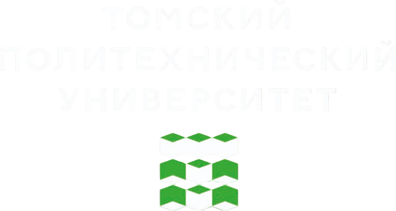

---
# ─────────────────────────────────────────────────────────────────────────────
# HEADMATTER -- шапка лекции. Поля title/lecture/topics попадают в оглавление
# сайта (см. tools/build_site.py), поэтому заполняйте их у каждой лекции.
# ─────────────────────────────────────────────────────────────────────────────
routerMode: hash
theme: default
title: Кортежи и множества
lecture: '06'
topics: кортежи, упаковка и распаковка, обмен значениями, распаковка со звёздочкой, сравнение кортежей, namedtuple, множества, операции над множествами, хеширование, frozenset

# ГЛАВНОЕ ДЛЯ СВЕТЛОЙ/ТЁМНОЙ ТЕМЫ:
#   auto  -- подхватывает системную тему студента, кнопка/клавиша d переключает
#   dark  -- только тёмная (так было раньше)
#   light -- только светлая
colorSchema: auto

# фон титульного слайда: две версии, выбор -- в самом слайде через <LightOrDark>
transition: slide-left
mdc: true
drawings:
  persist: false
duration: 90min

# Заметки докладчика видны только вам (клавиша p -> presenter mode)
---

<div class="cover-bg"></div>

<div class="cover-body flex flex-col justify-center h-full">

<h1>Основы программирования</h1>

<h2 class="!mt-0">Лекция 6. Кортежи (tuple) и множества (set)</h2>

<div class="cover-rule"></div>

###### Лекторы: 

<p class="text-[var(--ink-2)] mt-8">
1. Вячеслав Алексеевич Чузлов<br>
к.т.н., доцент ОХИ ИШПР ТПУ
</p>
<p class="text-[var(--ink-2)] mt-8">
2. Игорь Михайлович Долганов<br>
к.т.н., доцент ОХИ ИШПР ТПУ
</p>

</div>


---

# Два раствора

В два стакана с водой высыпали по четыре соли:

<div class="salts">
<b>Стакан 1</b><span>NaCl</span><span>K₂SO₄</span><span>MgCl₂</span><span>KNO₃</span>
<b>Стакан 2</b><span>CaCl₂</span><span>NaNO₃</span><span>NH₄Cl</span><span>KBr</span>
</div>

<div class="lead mt-4">
Какие ионы есть в обоих растворах? Какие только в первом, какие только во втором?
</div>

<v-click>

<div class="cols-2 mt-6">

<div>

- В обоих: **Na⁺, K⁺, Cl⁻, NO₃⁻**.
- Только в первом: **Mg²⁺, SO₄²⁻**. Только во втором: **Ca²⁺, NH₄⁺, Br⁻**.
- Хлорид-ион дали четыре соли из восьми, K⁺ в первом стакане две. В ответе каждый ион записан один раз.

</div>

<div>

<div class="warn">
Два столбца по восемь ионов ещё можно сверить глазами. Если растворов шесть, вопрос «какие ионы есть во всех» глазами уже не решается.
</div>

</div>

</div>

</v-click>

<div class="slide-no">Слайд {{ $nav.currentPage }} / {{ $nav.total }}</div>

<!--
Дать две минуты. Типичные ошибки: забывают NO3- в первом стакане (он пришёл из KNO3) или K+ во втором (из KBr), пишут Cl- по нескольку раз.
-->

---

# Та же задача в девять строк

```python
first  = [('Na+', 'Cl-'), ('K+', 'SO4 2-'), ('Mg2+', 'Cl-'), ('K+', 'NO3-')]
second = [('Ca2+', 'Cl-'), ('Na+', 'NO3-'), ('NH4+', 'Cl-'), ('K+', 'Br-')]
ions1, ions2 = set(), set()
for salt in first:
    ions1.update(salt)
for salt in second:
    ions2.update(salt)
print('в обоих:         ', sorted(ions1 & ions2))
print('только в первом: ', sorted(ions1 - ions2))
print('только во втором:', sorted(ions2 - ions1))
```

<pre class="output">в обоих:          ['Cl-', 'K+', 'NO3-', 'Na+']
только в первом:  ['Mg2+', 'SO4 2-']
только во втором: ['Br-', 'Ca2+', 'NH4+']</pre>

- Каждая соль -- **пара** в круглых скобках: катион и анион. Это *кортеж*, неизменяемый родственник списка.
- `set()` -- *множество*: каждый ион хранится в нём один раз, сколько бы солей его ни принесли. `&` -- общие элементы двух множеств, `-` -- элементы первого, которых нет во втором. К концу пары каждая строка будет понятна.

<div class="slide-no">Слайд {{ $nav.currentPage }} / {{ $nav.total }}</div>

---

# Коллекции в Python

Строки и списки из [лекций 4](https://vchuzlov.github.io/test-lectures/lec-04/#/2) и [5](https://vchuzlov.github.io/test-lectures/lec-05/#/4) -- не единственный способ хранить несколько значений вместе:

<div class="small-table">

| | Строка `str` | Список `list` | Кортеж `tuple` | Множество `set` |
|---|---|---|---|---|
| Пример | `'H2SO4'` | `[6.9, 7.1, 6.9]` | `('Na+', 'Cl-')` | `{'Na+', 'Cl-'}` |
| Элементы | символы | любые объекты | любые объекты | только неизменяемые |
| Порядок, индексы, срезы | есть | есть | есть | **нет** |
| Повторы | есть | есть | есть | **нет** |
| Можно изменить | нет | да | **нет** | да |

</div>

<div class="cols-2 mt-4">

<div>

- **Кортеж** -- список с гарантией: после создания он не изменится.
- **Множество** -- набор с гарантией: в нём нет повторов.

</div>

<div>

- Сегодня о том, зачем нужны эти гарантии и чем за них платят.
- В конце пары -- `frozenset`, неизменяемое множество. Словари (`dict`) -- в следующей лекции.

</div>

</div>

<div class="slide-no">Слайд {{ $nav.currentPage }} / {{ $nav.total }}</div>

---
layout: image-left
class: flex flex-col items-center justify-center
image: /pics/photo_2026-02-19_14-52-25.jpg
---

# Кортежи (`tuple`)

---

# Кортежи (`tuple`)

> Кортеж (тип `tuple`) -- <span class="text-[var(--brand)]">*упорядоченная неизменяемая последовательность*</span> объектов. Элементы записываются через запятую в круглых скобках `()`.

<div class="cols-2">

<div>

```python
ethanol = ('этанол', 'C2H5OH', 46.069, 78.4)
print(ethanol)
print(ethanol[0], ethanol[-1], ethanol[1:3])
print(len(ethanol), 'C2H5OH' in ethanol)
ethanol[2] = 46.07
```

<pre class="output">('этанол', 'C2H5OH', 46.069, 78.4)
этанол 78.4 ('C2H5OH', 46.069)
4 True
TypeError: 'tuple' object does not support item assignment</pre>

</div>

<div>

<FigAmpoules class="w-full mt-1" />

</div>

</div>

- Индексы, срезы, `len()`, `in`, перебор в `for` -- как у списка. Изменить нельзя: ни заменить элемент, ни добавить, ни удалить. Та же ошибка была у строки в [лекции 4](https://vchuzlov.github.io/test-lectures/lec-04/#/23).
- Список -- штатив с пробирками, кортеж -- кассета с запаянными ампулами: прочитать можно любую, заменить нельзя.

<div class="slide-no">Слайд {{ $nav.currentPage }} / {{ $nav.total }}</div>

---

# Кортеж создаёт запятая

<div class="cols-2">

<div>

```python
a = (2.512)          # число в скобках
b = (2.512,)         # кортеж из одного элемента
c = 2.512, 2.508     # кортеж без скобок
empty = ()
print(a * 2, b * 2)
print(c, empty, len(empty))
print(tuple('NaCl'), tuple([1, 2]))
```

<pre class="output">5.024 (2.512, 2.512)
(2.512, 2.508) () 0
('N', 'a', 'C', 'l') (1, 2)</pre>

</div>

<div>

- `(2.512)` -- просто число в скобках, как в арифметике. Кортеж из одного элемента пишут с запятой: `(2.512,)`.
- Скобки можно не писать: `c = 2.512, 2.508` -- тоже кортеж. Скобки нужны только для пустого кортежа `()` и там, где без них запись читается двусмысленно.
- `tuple()` собирает кортеж из любой последовательности, как `list()` в [лекции 5](https://vchuzlov.github.io/test-lectures/lec-05/#/7).

</div>

</div>

<div class="warn">
Лишняя запятая в конце строки – ошибка без сообщения: после <code>M = 18.015,</code> имя <code>M</code> ссылается на кортеж, и <code>M * 2</code> даёт <code>(18.015, 18.015)</code> вместо <code>36.03</code>.
</div>

<div class="slide-no">Слайд {{ $nav.currentPage }} / {{ $nav.total }}</div>

---

# Операции над кортежами

<div class="cols-2">

<div class="small-table">

|Операция|Результат|
|-|-|
|`t1 + t2`, `t * 3`|новый кортеж|
|`x in t`|есть ли `x`|
|`t.count(x)`|сколько раз есть `x`|
|`t.index(x)`|индекс первого `x`|
|`len()`, `min()`, `max()`, `sum()`|как у списка|
|`sorted(t)`|новый **список**|

</div>

<div>

```python
ph = (6.9, 7.1, 7.4, 6.9)
print(ph + (7.0,))
print(ph.count(6.9), ph.index(7.4))
print(sum(ph) / len(ph), max(ph))
print(sorted(ph))
```

<pre class="output">(6.9, 7.1, 7.4, 6.9, 7.0)
2 2
7.075 7.4
[6.9, 6.9, 7.1, 7.4]</pre>

</div>

</div>

- Методов у кортежа два: `count()` и `index()`. Если `x` нет, `index()` останавливает программу с `ValueError`, как у списка.
- Методов, меняющих список (`append()`, `sort()`, `pop()` и другие), у кортежа нет: отсортировать его на месте нельзя, `sorted()` вернёт новый список.

<div class="slide-no">Слайд {{ $nav.currentPage }} / {{ $nav.total }}</div>

---

# Зачем нужна неизменяемость

<div class="cols-2">

<div>

```python
masses = (12.011, 1.008, 15.999)   # C, H, O
alias = masses
alias += (14.007,)                  # N
print(masses)
print(alias)
print(masses is alias)
```

<pre class="output">(12.011, 1.008, 15.999)
(12.011, 1.008, 15.999, 14.007)
False</pre>

</div>

<div>

- `+=` для кортежа собирает **новый** кортеж и переводит на него имя `alias`, как для строки. Имя `masses` остаётся на прежнем объекте.
- В [лекции 5](https://vchuzlov.github.io/test-lectures/lec-05/#/32) оператор `+=` дописывал элемент в **тот же** список (модифицировал список на месте), и правку видели оба имени.

</div>

</div>

<ol class="steps">
<li><b>Данные, которые не должны меняться.</b> Атомные массы, константы, справочные записи. Случайная правка остановит программу в той строке, где её сделали, а не испортит результат молча.</li>
<li><b>Второе имя безопасно.</b> Кортеж можно отдать в другую часть программы без копии: изменить его не сможет никто.</li>
<li><b>Кортеж может быть элементом множества.</b> Список не может. Почему – в конце пары.</li>
</ol>

<div class="slide-no">Слайд {{ $nav.currentPage }} / {{ $nav.total }}</div>

---

# Неизменяемость не распространяется вглубь

<div class="cols-2">

<div>

```python
sample = ('проба 1', [2.512, 2.508])
sample[1].append(2.515)
print(sample)
sample[1] = [2.512]
```

<pre class="output">('проба 1', [2.512, 2.508, 2.515])
TypeError: 'tuple' object does not support item assignment</pre>

</div>

<div>

- Кортеж хранит **ссылки** на объекты. Неизменны именно они: второй элемент всегда будет ссылаться на тот же список.
- Сам список при этом остаётся списком, и его можно менять: `append()` сработал.
- Заменить список другим нельзя: это уже изменение кортежа.

</div>

</div>

<div class="warn">
Та же история, что с поверхностной копией в <a href="https://vchuzlov.github.io/test-lectures/lec-05/#/34">лекции 5</a>: внешний объект свой, вложенные общие. Кортеж, внутри которого список, только выглядит неизменяемым. И во множество его положить нельзя.
</div>

<div class="slide-no">Слайд {{ $nav.currentPage }} / {{ $nav.total }}</div>

---

# Что напечатает эта программа?

```python
row = ('проба 1', [2.512, 2.508])
old = row
row[1].append(2.515)
row += ('г',)
print(old)
print(row)
```

<v-click>

<pre class="output">('проба 1', [2.512, 2.508, 2.515])
('проба 1', [2.512, 2.508, 2.515], 'г')</pre>

- `row[1].append(2.515)` изменил список внутри кортежа. Кортеж один, на него смотрят оба имени, поэтому новое значение видно и через `old`.
- `row += ('г',)` собрал **новый** кортеж и перевёл на него имя `row`. `old` остался на прежнем кортеже, без `'г'`.
- Список внутри у обоих кортежей один и тот же: новый кортеж скопировал ссылку на него, а не сам список.

</v-click>

<div class="slide-no">Слайд {{ $nav.currentPage }} / {{ $nav.total }}</div>

<!--
Сначала спросить зал. Частые ответы: в old нет 2.515 («кортеж же нельзя изменить») или в old есть 'г' (со списком в лекции 5 так и было).
-->

---
layout: image-left
class: flex flex-col items-center justify-center
image: /pics/photo_2026-02-19_14-52-25.jpg
---

# Упаковка и распаковка

---

# Упаковка и распаковка

<div class="cols-2">

<div>

```python
water = 'вода', 'H2O', 18.015      # упаковка
name, formula, M = water           # распаковка
print(name, M)

M_C, M_H, M_O = 12.011, 1.008, 15.999
print(2 * M_C + 6 * M_H + M_O)

symbol, charge = ['Mg', 2]
print(symbol, charge)
a, b, c = 'NaCl'
```

<pre class="output">вода 18.015
46.069
Mg 2
ValueError: too many values to unpack (expected 3)</pre>

</div>

<div>

- Несколько значений через запятую справа от `=` Python **упаковывает** в кортеж.
- Несколько имён слева **распаковывают** последовательность: каждое имя получает свой элемент, по порядку.
- `M_C, M_H, M_O = ...` -- упаковка и распаковка в одной строке. Такая запись уже была в <br> [лекции 5](https://vchuzlov.github.io/test-lectures/lec-05/#/39).
- Распаковать можно любую последовательность: кортеж, список, строку. Число имён должно совпасть с числом элементов, иначе `ValueError`.

</div>

</div>

<div class="slide-no">Слайд {{ $nav.currentPage }} / {{ $nav.total }}</div>

---

# Обмен значений и несколько результатов

<div class="cols-2">

<div>

##### Обмен без третьей переменной

```python
t_low, t_high = 85.0, 60.0   # ввели не в том порядке
if t_low > t_high:
    t_low, t_high = t_high, t_low
print(t_low, t_high)
```

<div class='output'>60.0 85.0</div>

Правая часть вычисляется **целиком** до присваивания: сначала собирается кортеж `(60.0, 85.0)`, потом он распаковывается в два имени. Старые значения к этому моменту уже прочитаны, вспомогательная переменная не нужна.

</div>

<div>

##### Функция с двумя результатами

```python
minutes = 250                # длительность синтеза
print(divmod(minutes, 60))
hours, rest = divmod(minutes, 60)
print(f'{hours} ч {rest} мин')
```

<pre class="output">(4, 10)
4 ч 10 мин</pre>

`divmod()` возвращает сразу два числа: результаты `//` и `%` из [лекции 1](https://vchuzlov.github.io/test-lectures/lec-01/#/26). Возвращает их кортежем, а распаковка раскладывает по именам. Так устроены некоторые функции, у которых несколько результатов, в том числе те, что мы будем писать сами.

</div>

</div>

<div class="slide-no">Слайд {{ $nav.currentPage }} / {{ $nav.total }}</div>

---

# Распаковка со звёздочкой

<div class="cols-2">

<div>

```python
line = 'этанол 46.069 78.4 -114.1'
name, *values = line.split()
print(name, values)
numbers = [float(v) for v in values]
print(numbers)

first, *middle, last = (2.512, 2.508, 2.515, 2.511)
print(first, middle, last)
head, *tail = ['вода']
print(head, tail)
```

<pre class="output">этанол ['46.069', '78.4', '-114.1']
[46.069, 78.4, -114.1]
2.512 [2.508, 2.515] 2.511
вода []</pre>

</div>

<div>

- Имя со звёздочкой забирает **все оставшиеся** элементы. Остальные имена получают по одному.
- Звёздочка может стоять у одного имени: в начале, в середине или в конце.
- Имя со звёздочкой всегда получает **список**, даже если распаковывали кортеж, и даже если элементов не осталось: тогда список пустой.
- Удобно для строк данных: название, потом сколько угодно чисел. Метод `split()` и генератор списка -- из [лекции 5](https://vchuzlov.github.io/test-lectures/lec-05/#/41).

</div>

</div>

<div class="slide-no">Слайд {{ $nav.currentPage }} / {{ $nav.total }}</div>

---

# Распаковка в цикле `for`

<div class="cols-2">

<div>

```python
table = [('вода',   'H2O',    18.015),
         ('этанол', 'C2H5OH', 46.069),
         ('ацетон', 'C3H6O',  58.080)]

for name, formula, M in table:
    print(f'{name:<8}{formula:<8}{M:8.3f}')
```

<pre class="output">вода    H2O       18.015
этанол  C2H5OH    46.069
ацетон  C3H6O     58.080</pre>

```python
for i, (name, formula, M) in enumerate(table, 1):
    print(i, name)
```

<pre class="output">1 вода
2 этанол
3 ацетон</pre>

</div>

<div>

- Переменных цикла может быть несколько: на каждом проходе очередная строка таблицы распаковывается по именам. `name` и `M` читаются лучше, чем `row[0]` и `row[2]`.
- `enumerate()` и `zip()` из [лекции 5](https://vchuzlov.github.io/test-lectures/lec-05/#/38) выдают кортежи-пары. Там они распаковывались в `i, x` и `name, m`.
- Скобки `(name, formula, M)` распаковывают вложенный кортеж: вторая половина пары от `enumerate()` сама состоит из трёх элементов.
- Строки таблицы здесь кортежи: запись о веществе менять не собираемся.

</div>

</div>

<div class="slide-no">Слайд {{ $nav.currentPage }} / {{ $nav.total }}</div>

---

# Что напечатает эта программа?

```python
a, b = 1, 2
a, b = b, a + b
print(a, b)

a = b
b = a + b
print(a, b)
```

<v-click>

<pre class="output">2 3
3 6</pre>

- В первой части правая сторона `b, a + b` вычисляется до присваивания, со старыми `a = 1` и `b = 2`: получается кортеж `(2, 3)`.
- Во второй части присваивания идут по очереди: `a` уже стало `3`, и `b = a + b` даёт `3 + 3 = 6`.
- Запись в одну строку и в две -- разные программы. В одну строку все правые части считаются от старых значений.

</v-click>

<div class="slide-no">Слайд {{ $nav.currentPage }} / {{ $nav.total }}</div>

<!--
Сначала спросить зал. Частый ответ на первую строку: 2 4, как будто присваивания идут по очереди.
-->

---

# Сравнение и сортировка кортежей

<div class="cols-2">

<div>

```python
print((2, 'б') < (2, 'в'), (1, 'я') < (2, 'а'))
liquids = [(100.0, 'вода'), (78.4, 'этанол'),
           (56.1, 'ацетон'), (80.1, 'бензол')]
print(sorted(liquids))
print(min(liquids), max(liquids))
```

<pre class="output">True True
[(56.1, 'ацетон'), (78.4, 'этанол'), (80.1, 'бензол'), (100.0, 'вода')]
(56.1, 'ацетон') (100.0, 'вода')</pre>

</div>

<div>

- Кортежи сравниваются как списки в [лекции 5](https://vchuzlov.github.io/test-lectures/lec-05/#/26): по первому элементу, при равенстве по второму, и так далее.
- Если в записи **первым** стоит то, по чему сортируем, `sorted()`, `min()` и `max()` работают без `key`.
- `max(liquids)` возвращает всю запись: не только самую высокую температуру кипения, но и чья она.

</div>

</div>

Если данные записаны в другом порядке, то их можно переставить при помощи генератора списка:

```python
data = [('вода', 100.0), ('этанол', 78.4), ('ацетон', 56.1)]
print(min([(t, name) for name, t in data]))
```


<div class='output'>(56.1, 'ацетон')</div>

> *Есть более изящный способ с использованием аргумента `key` и `lambda` выражения, но о нём в лекции про функции

<div class="slide-no">Слайд {{ $nav.currentPage }} / {{ $nav.total }}</div>

---

# Именованные кортежи

<div class="cols-2">

<div>

```python
from collections import namedtuple

Substance = namedtuple('Substance', 'name formula M Tb')
water = Substance('вода', 'H2O', 18.015, 100.0)
print(water)
print(water.M, water[2], water.Tb + 273.15)
name, formula, M, Tb = water
water.M = 18.0
```

<pre class="output">Substance(name='вода', formula='H2O', M=18.015, Tb=100.0)
18.015 18.015 373.15
AttributeError: can't set attribute</pre>

</div>

<div>

- `namedtuple()` из модуля `collections` создаёт **новый тип** кортежа, у которого есть названия полей. `'Substance'` -- имя типа, `'name formula M Tb'` -- имена полей через пробел.
- К полю обращаются через точку: `water.M` понятнее, чем `water[2]`. Индексы, срезы и распаковка тоже работают: это обычный кортеж.
- Изменить поле нельзя, как и любой элемент кортежа. А `print()` показывает имена полей: запись читается без подсказки.

</div>

</div>

<div class="note">
Модуль <code>collections</code> входит в стандартную библиотеку Python, ставить ничего не нужно. В следующей лекции возьмём оттуда же <code>Counter</code> и <code>defaultdict</code>.
</div>

<div class="slide-no">Слайд {{ $nav.currentPage }} / {{ $nav.total }}</div>

---

# Таблица из именованных кортежей

```python
from collections import namedtuple
Substance = namedtuple('Substance', 'name formula M Tb')
table = [Substance('вода',   'H2O',    18.015, 100.0),
         Substance('этанол', 'C2H5OH', 46.069,  78.4),
         Substance('ацетон', 'C3H6O',  58.080,  56.1),
         Substance('бензол', 'C6H6',   78.114,  80.1)]
```

<div class="cols-2">

<div>

##### Поля по имени

```python
print([s.name for s in table if s.Tb < 80])
print(max([s.M for s in table]))
print(table[1].formula)
```

<pre class="output">['этанол', 'ацетон']
78.114
C2H5OH</pre>

</div>

<div>

##### То же по индексам

```python
print([s[0] for s in table if s[3] < 80])
print(max([s[2] for s in table]))
print(table[1][1])
```

Результат тот же. Но через месяц уже не вспомнить, что лежит в `s[3]`, а `s.Tb` объясняет себя сам.

</div>

</div>

<div class="slide-no">Слайд {{ $nav.currentPage }} / {{ $nav.total }}</div>

---

# Кортеж или список?

<div class="small-table">

| Что храним | Тип | Почему |
|---|---|---|
| Серия измерений, которая пополняется | список | однотипные значения, число заранее неизвестно |
| Запись о веществе: название, формула, M | кортеж или `namedtuple` | число и смысл полей заданы, менять запись не нужно |
| Константы и справочные данные | кортеж | защита от случайной правки |
| Пара «катион -- анион», пара «номер -- значение» | кортеж | два разных значения, связанных между собой |
| Таблица, в которой правят значения | список списков | строки меняются на месте |
| Элемент множества | кортеж | список во множество положить нельзя |

</div>

<div class="cols-2 mt-6">

<div class="note">
Список – <b>сколько угодно однотипных</b> значений. Кортеж – <b>заданное число разных</b> значений, которые вместе описывают один объект.
</div>

<div>

Переход между ними всегда возможен: `list(t)` даёт список с теми же элементами, `tuple(a)` -- кортеж.

</div>

</div>

<div class="slide-no">Слайд {{ $nav.currentPage }} / {{ $nav.total }}</div>

---
layout: image-left
class: flex flex-col items-center justify-center
image: /pics/photo_2026-02-19_14-52-25.jpg
---

# Множества (`set`)

---

# Множества (`set`)

> Множество (тип `set`) -- <span class="text-[var(--brand)]">*неупорядоченная изменяемая коллекция уникальных элементов*</span>. Элементы записываются через запятую в фигурных скобках `{}`.

<div class="cols-2">

<div>

```python
ions = {'Na+', 'Cl-', 'Na+', 'K+', 'Cl-'}
print(len(ions), sorted(ions))
print('K+' in ions, 'Mg2+' in ions)
print(sorted(set('CH3COOH')))
print({2, 2.0, 1, True})
print(ions[0])
```

<pre class="output">3 ['Cl-', 'K+', 'Na+']
True False
['3', 'C', 'H', 'O']
{1, 2}
TypeError: 'set' object is not subscriptable</pre>

</div>

<div>

- Повторы пропадают при создании: каждый элемент хранится **один раз**.
- Одинаковость проверяется через `==`: `2` и `2.0` равны, `True` равно `1` ([лекция 2](https://vchuzlov.github.io/test-lectures/lec-02/#/3)). Остаётся тот, что записан первым.
- Порядка нет, поэтому нет индексов и срезов. Есть `len()`, `in` и перебор в `for`.
- `set()` от строки даёт множество её символов, от списка -- его элементы без повторов.

</div>

</div>

<div class="slide-no">Слайд {{ $nav.currentPage }} / {{ $nav.total }}</div>

---

# Пустое множество и `set()`

<div class="cols-2">

<div>

```python
empty = set()
print(empty, len(empty))
print({}, type({}) == dict)

masses = [2.512, 2.508, 2.512, 2.515, 2.508]
print(len(masses), len(set(masses)))
print(sorted(set(masses)))
print(set(range(5)))
```

<pre class="output">set() 0
{} True
5 3
[2.508, 2.512, 2.515]
{0, 1, 2, 3, 4}</pre>

</div>

<div>

- `{}` -- пустой **словарь** (тема следующей лекции), а не множество. Пустое множество создают только через `set()`, и печатается оно тоже как `set()`.
- `len(set(...))` -- сколько **разных** значений в списке.
- `sorted(set(...))` -- разные значения по возрастанию, сразу списком.

</div>

</div>

<div class="warn">
<code>list(set(a))</code> тоже убирает повторы, но порядок исходного списка при этом теряется. Если он важен, повторы убирают иначе – в следующей лекции.
</div>

<div class="slide-no">Слайд {{ $nav.currentPage }} / {{ $nav.total }}</div>

---

# У множества нет порядка

Одна и та же программа, запущенная три раза:

```python
ions = {'Na+', 'Cl-', 'K+', 'Mg2+'}
print(ions)
```

<div class="cols-3">
<div class='output'>{'K+', 'Cl-', 'Mg2+', 'Na+'}</div>
<div class='output'>{'Cl-', 'K+', 'Na+', 'Mg2+'}</div>
<div class='output'>{'Cl-', 'Mg2+', 'Na+', 'K+'}</div>
</div>

<div class="cols-2 mt-4">

<div>

- Множество хранит элементы так, как ему удобно искать, а не так, как их записали. Для строк этот порядок меняется **от запуска к запуску**: почему -- в разделе о хешировании.
- Перебор в `for` идёт в том же случайном порядке.

</div>

<div>

```python
print({3, 1, 2}, {100, 5, 33})
```

<div class='output'>{1, 2, 3} {33, 100, 5}</div>

Небольшие целые числа часто выходят по возрастанию. Это совпадение, а не правило.

</div>

</div>

<div class="note">
Когда порядок нужен – для печати, для отчёта, для сравнения с ответом, – множество превращают в список через <code>sorted()</code>.
</div>

<div class="slide-no">Слайд {{ $nav.currentPage }} / {{ $nav.total }}</div>

---

# Изменение множества

<div class="cols-2">

<div>

```python
ions = {'Na+', 'Cl-'}
ions.add('K+')
ions.add('Na+')                 # уже есть
ions.update(['Br-', 'I-'])
ions.discard('F-')              # нет - и ладно
ions.remove('I-')
print(sorted(ions))
ions.remove('F-')
```

<pre class="output">['Br-', 'Cl-', 'K+', 'Na+']
KeyError: 'F-'</pre>

</div>

<div>

<div class="small-table">

|Метод|Действие|
|-|-|
|`add(x)`|добавляет один элемент|
|`update(seq)`|добавляет все элементы последовательности|
|`remove(x)`|удаляет `x`; если его нет, `KeyError`|
|`discard(x)`|удаляет `x`, если он есть|
|`pop()`|удаляет и возвращает **какой-то** элемент|
|`clear()`|удаляет все элементы|
|`copy()`|возвращает копию|

</div>

</div>

</div>

- Повторное `add()` ничего не меняет и ошибки не даёт: элемент уже есть.
- `update()` для множества -- то же, что `extend()` для списка: принимает последовательность и добавляет её элементы по одному.
- Какой элемент вернёт `pop()`, заранее неизвестно: порядка у множества нет.

<div class="slide-no">Слайд {{ $nav.currentPage }} / {{ $nav.total }}</div>

---

# Поиск во множестве быстрее

```python
import time
numbers = list(range(1_000_000))
numbers_set = set(numbers)

start = time.perf_counter()
found = 999_999 in numbers
print(f'список:    {time.perf_counter() - start:.6f} с')

start = time.perf_counter()
found = 999_999 in numbers_set
print(f'множество: {time.perf_counter() - start:.6f} с')
```

<pre class="output">список:    0.008686 с
множество: 0.000002 с</pre>

- `time.perf_counter()` -- секундомер: разность двух показаний равна прошедшему времени. В `1_000_000` подчёркивания только для чтения.
- `in` по списку сравнивает искомое с каждым элементом: миллион сравнений. Множество находит элемент **сразу** (как -- в разделе о хешировании). На другом компьютере числа другие, но разница -- в тысячи раз.

<div class="slide-no">Слайд {{ $nav.currentPage }} / {{ $nav.total }}</div>

---

# Генераторы множеств

> Генератор множества записывается как генератор списка из [лекции 5](https://vchuzlov.github.io/test-lectures/lec-05/#/41), только в фигурных скобках. Результат -- множество: повторы отбрасываются.

<div class="cols-2">

<div>

```python
print(sorted({ch for ch in 'C2H5OH' if ch.isalpha()}))
print(sorted({ch for ch in 'CH3Cl' if ch.isalpha()}))
masses = [2.512, 2.508, 2.515, 2.152]
print(sorted({round(m, 1) for m in masses}))
```

<pre class="output">['C', 'H', 'O']
['C', 'H', 'l']
[2.2, 2.5]</pre>

- Буквы формулы -- это элементы, пока все символы однобуквенные. В `'CH3Cl'` хлор распался на `C` и `l`.
- Округление до десятых показывает, что в серии два разных значения: промах сразу виден.

</div>

<div>

##### Элементы с двухбуквенными символами

```python
f = 'CH3Cl'
elements = set()
for i, ch in enumerate(f):
    if ch.isupper():
        if f[i + 1:i + 2].islower():
            elements.add(ch + f[i + 1])
        else:
            elements.add(ch)
print(sorted(elements))
```

<div class='output'>['C', 'Cl', 'H']</div>

Символ элемента -- заглавная буква и, возможно, строчная после неё. Срез `f[i + 1:i + 2]` за концом строки даёт `''`, а не ошибку.

</div>

</div>

<div class="slide-no">Слайд {{ $nav.currentPage }} / {{ $nav.total }}</div>

---

# Что напечатает эта программа?

```python
ions = {'K+'}
ions.add('Na+')
ions.update('Cl-')
print(len(ions), sorted(ions))
```

<v-click>

<div class='output'>5 ['-', 'C', 'K+', 'Na+', 'l']</div>

- `update()` ждёт последовательность и добавляет её элементы по одному. Строка -- последовательность **символов**, поэтому во множество попали `'C'`, `'l'` и `'-'`, а не `'Cl-'`.
- Так же ведут себя `set('Cl-')` и `extend('Cl-')` у списка.
- Один элемент добавляют через `add('Cl-')`. Несколько -- через `update()` со списком или кортежем: `update(['Cl-', 'Br-'])`.

</v-click>

<div class="slide-no">Слайд {{ $nav.currentPage }} / {{ $nav.total }}</div>

<!--
Сначала спросить зал. Почти все ответят 3. Хорошо бы вернуться к слайду 3: там update() получал кортеж-соль, и всё было правильно.
-->

---
layout: image-left
class: flex flex-col items-center justify-center
image: /pics/photo_2026-02-19_14-52-25.jpg
---

# Операции над множествами

---

# Четыре операции

<div class="venns">
<figure><svg viewBox="0 0 120 84" class="venn"><defs><clipPath id="vn-cb"><circle cx="72" cy="42" r="32"/></clipPath><mask id="vn-na"><rect width="120" height="84" fill="white"/><circle cx="48" cy="42" r="32" fill="black"/></mask><mask id="vn-nb"><rect width="120" height="84" fill="white"/><circle cx="72" cy="42" r="32" fill="black"/></mask></defs><g class="venn-fill"><circle cx="48" cy="42" r="32"/><circle cx="72" cy="42" r="32"/></g><circle cx="48" cy="42" r="32" class="venn-line"/><circle cx="72" cy="42" r="32" class="venn-line"/><text x="30" y="46" class="venn-t">a</text><text x="84" y="46" class="venn-t">b</text></svg><figcaption><code>a | b</code><br>объединение</figcaption></figure>
<figure><svg viewBox="0 0 120 84" class="venn"><g class="venn-fill"><circle cx="48" cy="42" r="32" clip-path="url(#vn-cb)"/></g><circle cx="48" cy="42" r="32" class="venn-line"/><circle cx="72" cy="42" r="32" class="venn-line"/><text x="30" y="46" class="venn-t">a</text><text x="84" y="46" class="venn-t">b</text></svg><figcaption><code>a &amp; b</code><br>пересечение</figcaption></figure>
<figure><svg viewBox="0 0 120 84" class="venn"><g class="venn-fill"><circle cx="48" cy="42" r="32" mask="url(#vn-nb)"/></g><circle cx="48" cy="42" r="32" class="venn-line"/><circle cx="72" cy="42" r="32" class="venn-line"/><text x="30" y="46" class="venn-t">a</text><text x="84" y="46" class="venn-t">b</text></svg><figcaption><code>a - b</code><br>разность</figcaption></figure>
<figure><svg viewBox="0 0 120 84" class="venn"><g class="venn-fill"><circle cx="48" cy="42" r="32" mask="url(#vn-nb)"/><circle cx="72" cy="42" r="32" mask="url(#vn-na)"/></g><circle cx="48" cy="42" r="32" class="venn-line"/><circle cx="72" cy="42" r="32" class="venn-line"/><text x="30" y="46" class="venn-t">a</text><text x="84" y="46" class="venn-t">b</text></svg><figcaption><code>a ^ b</code><br>симметрическая разность</figcaption></figure>
</div>

```python
ions1 = {'Na+', 'K+', 'Mg2+', 'Cl-', 'SO4 2-', 'NO3-'}
ions2 = {'Ca2+', 'Na+', 'NH4+', 'K+', 'Cl-', 'NO3-', 'Br-'}
print(sorted(ions1 | ions2))
print(sorted(ions1 & ions2))
print(sorted(ions1 - ions2), sorted(ions2 - ions1))
print(sorted(ions1 ^ ions2))
```

<pre class="output">['Br-', 'Ca2+', 'Cl-', 'K+', 'Mg2+', 'NH4+', 'NO3-', 'Na+', 'SO4 2-']
['Cl-', 'K+', 'NO3-', 'Na+']
['Mg2+', 'SO4 2-'] ['Br-', 'Ca2+', 'NH4+']
['Br-', 'Ca2+', 'Mg2+', 'NH4+', 'SO4 2-']</pre>

<div class="slide-no">Слайд {{ $nav.currentPage }} / {{ $nav.total }}</div>

---

# Операторы и методы

<div class="small-table">

|Оператор|Метод|Результат|
|-|-|-|
|`a \| b`|`a.union(b)`|все элементы из `a` и из `b`|
|`a & b`|`a.intersection(b)`|элементы, которые есть и в `a`, и в `b`|
|`a - b`|`a.difference(b)`|элементы `a`, которых нет в `b`|
|`a ^ b`|`a.symmetric_difference(b)`|элементы, которые есть ровно в одном из двух|
|`a <= b`|`a.issubset(b)`|`True`, если все элементы `a` есть в `b`|
|`a >= b`|`a.issuperset(b)`|`True`, если все элементы `b` есть в `a`|
| |`a.isdisjoint(b)`|`True`, если общих элементов нет|
|`a \|= b`, `a &= b`, `a -= b`|`a.update(b)` и другие|то же, но результат записывается в `a`, на месте|

</div>

<div class="cols-2 mt-2">

<div>

- `|`, `&`, `-`, `^` возвращают **новое** множество, исходные не меняются.
- `-` и `<=` несимметричны: `a - b` и `b - a` -- разные множества.

</div>

<div>

- Операторы требуют множеств с обеих сторон: `{1, 2} | [3]` даёт `TypeError`. Методы принимают любую последовательность: `{1, 2}.union([3])` работает.

</div>

</div>

<div class="slide-no">Слайд {{ $nav.currentPage }} / {{ $nav.total }}</div>

---

# Всё ли есть? Нет ли общих?

<div class="cols-2">

<div>

##### Хватит ли реактивов для опыта

```python
need = {'HCl', 'NaOH', 'фенолфталеин'}
shelf = {'HCl', 'H2SO4', 'NaOH', 'KOH', 'метилоранж'}
print(need <= shelf)
print(need - shelf)
```

<pre class="output">False
{'фенолфталеин'}</pre>

`need <= shelf` -- всё ли нужное есть на полке. Если нет, `need - shelf` показывает, чего не хватает.

</div>

<div>

##### Есть ли в воде ионы жёсткости

```python
hardness = {'Ca2+', 'Mg2+'}
sample = {'Na+', 'K+', 'Cl-', 'HCO3-'}
ions1 = {'Na+', 'K+', 'Mg2+', 'Cl-', 'SO4 2-', 'NO3-'}
ions2 = {'Ca2+', 'Na+', 'NH4+', 'K+', 'Cl-', 'NO3-', 'Br-'}
print(sample.isdisjoint(hardness))
print(ions1 & hardness, ions2 & hardness)
```

<pre class="output">True
{'Mg2+'} {'Ca2+'}</pre>

`isdisjoint()` -- нет ли ни одного общего элемента. В пробе `sample` ионов жёсткости нет, в стаканах из начала пары есть в обоих.

</div>

</div>

<div class="note">
Множество из одного элемента печатается одинаково при любом запуске, поэтому здесь можно обойтись без <code>sorted()</code>.
</div>

<div class="slide-no">Слайд {{ $nav.currentPage }} / {{ $nav.total }}</div>

---

# Равенство без учёта порядка

<div class="cols-2">

<div>

```python
print([1, 2, 3] == [3, 2, 1])
print(set([1, 2, 3]) == set([3, 2, 1]))

e1 = {ch for ch in 'C2H5OH' if ch.isalpha()}
e2 = {ch for ch in 'CH3OCH3' if ch.isalpha()}
e3 = {ch for ch in 'CH3COOH' if ch.isalpha()}
print(e1 == e2 == e3, sorted(e1))
```

<pre class="output">False
True
True ['C', 'H', 'O']</pre>

</div>

<div>

- Списки равны, если совпадают элементы **и порядок**. Множества равны, если совпадает **состав**.
- Этанол, диметиловый эфир и уксусная кислота состоят из одних и тех же элементов. Множества элементов равны, а вещества разные.
- Множество отвечает на вопрос «какие элементы есть», но не на вопрос «сколько атомов каждого». Этанол и диметиловый <br> эфир -- изомеры, у них совпадает и число атомов. У уксусной кислоты оно другое, а множество этого не видит.

</div>

</div>

<div class="slide-no">Слайд {{ $nav.currentPage }} / {{ $nav.total }}</div>

---
layout: image-left
class: flex flex-col items-center justify-center
image: /pics/photo_2026-02-19_14-52-25.jpg
---

# Что можно положить во множество

---

# Не всё можно положить во множество

<div class="cols-2">

<div>

```python
salts = {('Na+', 'Cl-'), ('K+', 'Cl-'), ('Na+', 'Cl-')}
print(len(salts))
salts = {['Na+', 'Cl-'], ['K+', 'Cl-']}
```

<pre class="output">2
TypeError: cannot use 'list' as a set element (unhashable type: 'list')</pre>

```python
inner = {1, 2}
outer = {inner}
```

<pre class="output">TypeError: cannot use 'set' as a set element (unhashable type: 'set')</pre>

</div>

<div>

<div class="small-table">

| Можно | Нельзя |
|---|---|
| `int`, `float`, `bool`, `str` | `list` |
| `tuple` из неизменяемых | `set` |
| `frozenset` | `dict` |
| | `tuple`, внутри которого список |

</div>

Элементом множества может быть только **хешируемый** объект. Из знакомых типов это неизменяемые: числа, строки, кортежи.

</div>

</div>

<div class="warn">
До Python 3.14 сообщение короче: <code>TypeError: unhashable type: 'list'</code>. Ключевое слово то же: <i>unhashable</i>, «не хешируемый».
</div>

<div class="slide-no">Слайд {{ $nav.currentPage }} / {{ $nav.total }}</div>

---

# Как множество находит элемент

<div class="cols-2">

<div>

```python
print(hash(46), hash(2.0), hash(2))
print(hash('Na+'))
print(hash(('Na+', 'Cl-')) == hash(('Na+', 'Cl-')))
print(hash([1, 2]))
```

<pre class="output">46 2 2
-7341686027820914496
True
TypeError: unhashable type: 'list'</pre>

- `hash()` превращает объект в целое число. Равные объекты -- равный хеш: `hash(2.0) == hash(2)`.
- Хеш строки при каждом запуске свой: отсюда и порядок печати.

</div>

<div>

<svg class="hsh" viewBox="0 0 440 240" width="420" xmlns="http://www.w3.org/2000/svg">
<defs><marker id="hs-head" viewBox="0 0 10 10" refX="9" refY="5" markerWidth="7" markerHeight="7" orient="auto"><path d="M0,0 L10,5 L0,10 z" class="hsh-headpath"/></marker></defs>
<rect x="0" y="12" width="80" height="34" rx="6" class="hsh-obj"/><text x="40" y="35" class="hsh-t">'K+'</text>
<path d="M80,29 L126,29" class="hsh-arrow" marker-end="url(#hs-head)"/>
<text x="103" y="20" class="hsh-lbl">hash()</text>
<rect x="128" y="12" width="110" height="34" rx="6" class="hsh-num"/><text x="183" y="35" class="hsh-t">…8301</text>
<path d="M238,29 L278,29" class="hsh-arrow" marker-end="url(#hs-head)"/>
<text x="258" y="20" class="hsh-lbl">% 8</text>
<rect x="280" y="12" width="44" height="34" rx="6" class="hsh-num"/><text x="302" y="35" class="hsh-t">5</text>
<path d="M302,46 L302,138" class="hsh-arrow" marker-end="url(#hs-head)"/>
<g class="hsh-cells">
<rect x="0"   y="142" width="54" height="40" rx="4"/><rect x="55"  y="142" width="54" height="40" rx="4"/>
<rect x="110" y="142" width="54" height="40" rx="4"/><rect x="165" y="142" width="54" height="40" rx="4"/>
<rect x="220" y="142" width="54" height="40" rx="4"/><rect x="275" y="142" width="54" height="40" rx="4"/>
<rect x="330" y="142" width="54" height="40" rx="4"/><rect x="385" y="142" width="54" height="40" rx="4"/>
</g>
<rect x="55"  y="142" width="54" height="40" rx="4" class="hsh-full"/><text x="82"  y="167" class="hsh-ts">'Na+'</text>
<rect x="165" y="142" width="54" height="40" rx="4" class="hsh-full"/><text x="192" y="167" class="hsh-ts">'Cl-'</text>
<rect x="275" y="142" width="54" height="40" rx="4" class="hsh-hit"/><text x="302" y="167" class="hsh-ts">'K+'</text>
<text x="27"  y="204" class="hsh-i">0</text><text x="82"  y="204" class="hsh-i">1</text>
<text x="137" y="204" class="hsh-i">2</text><text x="192" y="204" class="hsh-i">3</text>
<text x="247" y="204" class="hsh-i">4</text><text x="302" y="204" class="hsh-i">5</text>
<text x="357" y="204" class="hsh-i">6</text><text x="412" y="204" class="hsh-i">7</text>
<text x="0" y="232" class="hsh-lbl" style="text-anchor:start">ячейки множества; номер ячейки вычисляется из хеша</text>
</svg>

- `x in s` -- посчитать хеш `x` и заглянуть в **одну** ячейку, а не перебирать все.
- Изменись элемент -- изменился бы хеш, а лежал бы элемент в старой ячейке, и множество его бы не нашло. Поэтому у изменяемых объектов хеша нет.

</div>

</div>

<div class="slide-no">Слайд {{ $nav.currentPage }} / {{ $nav.total }}</div>

---

# `frozenset`: неизменяемое множество

<div class="cols-2">

<div>

```python
pair = frozenset({'HCl', 'NaOH'})
print(pair == frozenset({'NaOH', 'HCl'}))
print('HCl' in pair, len(pair))

reacts = {frozenset({'HCl', 'NaOH'}),
          frozenset({'AgNO3', 'NaCl'}),
          frozenset({'BaCl2', 'Na2SO4'})}
print(frozenset({'Na2SO4', 'BaCl2'}) in reacts)
print(frozenset({'NaCl', 'KNO3'}) in reacts)
pair.add('H2O')
```

<pre class="output">True
True 2
True
False
AttributeError: 'frozenset' object has no attribute 'add'</pre>

</div>

<div>

- `frozenset()` -- множество, которое нельзя изменить: у него нет `add()`, `remove()`, `update()`. Операции `|`, `&`, `-`, `^`, `in`, `len()` работают.
- Неизменяемое -- значит хешируемое: `frozenset` может быть элементом множества. Обычное `set` не может.
- `reacts` -- пары растворов, которые реагируют при сливании: нейтрализация, осадки AgCl и BaSO₄. У пары нет порядка: слить BaCl₂ с Na₂SO₄ -- то же, что Na₂SO₄ с BaCl₂.
- Кортежи `('BaCl2', 'Na2SO4')` и `('Na2SO4', 'BaCl2')` разные, а `frozenset` из тех же двух веществ один.

</div>

</div>

<div class="slide-no">Слайд {{ $nav.currentPage }} / {{ $nav.total }}</div>

---

# Что напечатает эта программа?

```python
t = {('HCl', 'NaOH'), ('NaOH', 'HCl'), ('HCl', 'NaOH')}
f = {frozenset({'HCl', 'NaOH'}), frozenset({'NaOH', 'HCl'})}
print(len(t), len(f))
```

<v-click>

<div class='output'>2 1</div>

- В `t` три кортежа, но первый и третий равны: остаётся два. `('HCl', 'NaOH')` и `('NaOH', 'HCl')` -- разные кортежи, порядок у кортежа важен.
- В `f` два `frozenset`, и они равны: состав одинаковый, а порядка у множества нет. Остаётся один.
- Когда пара упорядочена (катион и анион, номер и значение), её хранят кортежем. Когда нет (два вещества, которые реагируют друг с другом), -- `frozenset`.

</v-click>

<div class="slide-no">Слайд {{ $nav.currentPage }} / {{ $nav.total }}</div>

<!--
Сначала спросить зал. Частые ответы: 3 2 (не убирают повтор) или 1 1 (считают кортежи неупорядоченными).
-->

---

# Множество множеств

Сколько разных наборов элементов среди десяти веществ?

<div class="cols-2">

<div>

```python
formulas = ['H2O', 'H2O2', 'CO', 'CO2', 'CH4', 'C2H6',
            'C2H5OH', 'CH3COOH', 'C6H12O6', 'NH3']
kinds = set()
for f in formulas:
    elements = {ch for ch in f if ch.isalpha()}
    kinds.add(frozenset(elements))
print(len(kinds))
print(sorted([sorted(k) for k in kinds]))
```

<pre class="output">5
[['C', 'H'], ['C', 'H', 'O'], ['C', 'O'], ['H', 'N'], ['H', 'O']]</pre>

</div>

<div>

- Набор элементов одного вещества -- множество. Набор разных наборов -- множество множеств, и внутренние должны быть неизменяемыми: `frozenset`.
- С `kinds.add(elements)` без `frozenset()` программа остановится на первом же веществе с `TypeError`.
- Для печати каждое внутреннее множество превращено в отсортированный список, и список списков отсортирован тоже: так ответ не зависит от запуска.

</div>

</div>

<div class="slide-no">Слайд {{ $nav.currentPage }} / {{ $nav.total }}</div>

---

# Возвращаемся к двум растворам

<div class="cols-2">

<div>

```python
first  = [('Na+', 'Cl-'), ('K+', 'SO4 2-'),
          ('Mg2+', 'Cl-'), ('K+', 'NO3-')]
second = [('Ca2+', 'Cl-'), ('Na+', 'NO3-'),
          ('NH4+', 'Cl-'), ('K+', 'Br-')]

ions1 = set()
for cation, anion in first:
    ions1 |= {cation, anion}
ions2 = set()
for cation, anion in second:
    ions2 |= {cation, anion}

print(f'{"ион":<8}{"1":^5}{"2":^5}')
for ion in sorted(ions1 | ions2):
    mark1 = '+' if ion in ions1 else '.'
    mark2 = '+' if ion in ions2 else '.'
    print(f'{ion:<8}{mark1:^5}{mark2:^5}')
```

</div>

<div>

<pre class="output">ион       1    2  
Br-       .    +  
Ca2+      .    +  
Cl-       +    +  
K+        +    +  
Mg2+      +    .  
NH4+      .    +  
NO3-      +    +  
Na+       +    +  
SO4 2-    +    .  </pre>

- Соль -- кортеж из двух ионов, в цикле он распаковывается в `cation, anion`.
- `|=` добавляет во множество оба иона, повторы отбрасываются сами.
- Объединение даёт все ионы, `sorted()` -- порядок строк, `in` по множеству -- отметки в столбцах.

</div>

</div>

<div class="slide-no">Слайд {{ $nav.currentPage }} / {{ $nav.total }}</div>

---

# Данные изменились

Растворов не два, а **шесть**. Какие ионы есть во всех?

```python
solutions = [
    [('Na+', 'Cl-'), ('K+', 'SO4 2-'), ('Mg2+', 'Cl-'), ('K+', 'NO3-')],
    [('Ca2+', 'Cl-'), ('Na+', 'NO3-'), ('NH4+', 'Cl-'), ('K+', 'Br-')],
    [('Na+', 'Cl-'), ('K+', 'I-'), ('Na+', 'SO4 2-')],
    [('K+', 'Cl-'), ('Na+', 'NO3-'), ('Zn2+', 'SO4 2-')],
    [('Na+', 'Cl-'), ('K+', 'NO3-'), ('Na+', 'Br-')],
    [('K+', 'Cl-'), ('Na+', 'Br-'), ('Al3+', 'NO3-')],
]
```

<div class="cols-2">

<div>

```python
ion_sets = []
for sol in solutions:
    ions = set()
    for salt in sol:
        ions.update(salt)
    ion_sets.append(ions)
```

</div>

<div>

```python
common = ion_sets[0].copy()
for ions in ion_sets[1:]:
    common &= ions
print('во всех шести:', sorted(common))
```

<div class='output'>во всех шести: ['Cl-', 'K+', 'Na+']</div>

</div>

</div>

<div class="warn">
<code>copy()</code> здесь обязателен. <code>&amp;=</code> меняет множество на месте, и без копии <code>common</code> было бы вторым именем <code>ion_sets[0]</code>: пересечение испортило бы ионы первого раствора (<a href="https://vchuzlov.github.io/test-lectures/lec-05/#/31">лекция 5</a>).
</div>

<div class="slide-no">Слайд {{ $nav.currentPage }} / {{ $nav.total }}</div>

---

# Какие ионы есть только в одном растворе?

<div class="cols-2">

<div>

```python
every = []
for ions in ion_sets:
    every.extend(ions)
print(len(every), len(set(every)))

once = [ion for ion in every
        if every.count(ion) == 1]
print('только в одном:', sorted(once))
```

<pre class="output">35 12
только в одном: ['Al3+', 'Ca2+', 'I-', 'Mg2+', 'NH4+', 'Zn2+']</pre>

</div>

<div>

- В список `every` каждый ион попадает столько раз, во скольких растворах он есть: 35 записей. Разных среди них 12 -- столько элементов в `set(every)`.
- `every.count(ion)` -- во скольких растворах встретился ион. Отбираем те, у которых ответ 1. Такой ион и в списке записан один раз, поэтому повторов в ответе не будет.
- Список помнит повторы, множество -- нет. Поэтому «сколько раз» спрашивают у списка.

</div>

</div>

<div class="note">
Каждый вызов <code>count()</code> проходит весь список. Для 35 записей это незаметно, для тысяч уже медленно. Подсчёт «сколько раз встречается каждый» за один проход делает словарь – в следующей лекции.
</div>

<div class="slide-no">Слайд {{ $nav.currentPage }} / {{ $nav.total }}</div>

---

# Множество не умеет считать

Метан сгорает в кислороде. Совпадают ли элементы слева и справа?

```python
left = 'CH4 + O2'
right = 'CO2 + H2O'
print({ch for ch in left if ch.isalpha()} == {ch for ch in right if ch.isalpha()})
```

<div class='output'>True</div>

<v-clicks>

- Элементы одни и те же: C, H, O. Но уравнение не уравнено: слева 4 атома водорода, справа 2; кислорода 2 и 3.
- Правильно: CH₄ + 2O₂ → CO₂ + 2H₂O. Множество разницы не заметит: повторы оно отбрасывает, и «сколько» для него не существует.
- Чтобы проверить уравнение, каждому элементу нужно сопоставить число атомов: `C -> 1`, `H -> 4`, `O -> 4`. Такая таблица «ключ -- значение» называется **словарь** -- тема следующей лекции.

</v-clicks>

<div class="slide-no">Слайд {{ $nav.currentPage }} / {{ $nav.total }}</div>

<!--
Спросить зал, уравнено ли уравнение, до того как открыть пункты.
-->

---

# Частые ошибки

<ol class="steps">
<li><b>Кортеж без запятой и запятая без кортежа.</b> <code>(5)</code> – число, кортеж из одного элемента – <code>(5,)</code>. Лишняя запятая в <code>M = 18.015,</code> делает <code>M</code> кортежем.</li>
<li><b>Число имён не совпадает с числом элементов</b> при распаковке: <code>ValueError: too many values to unpack</code>.</li>
<li><b><code>{}</code> вместо <code>set()</code>.</b> Пустые фигурные скобки – словарь. Пустое множество – только <code>set()</code>.</li>
<li><b>Расчёт на порядок элементов множества.</b> Индексов нет, порядок печати меняется от запуска к запуску. Для печати и сравнения – <code>sorted()</code>.</li>
<li><b><code>update('Cl-')</code> вместо <code>add('Cl-')</code>.</b> Строка разбирается на символы. Один элемент – <code>add()</code>, несколько – <code>update()</code> со списком.</li>
<li><b>Список или множество внутри множества:</b> <code>TypeError: ... unhashable</code>. Вместо списка – кортеж, вместо множества – <code>frozenset</code>.</li>
<li><b><code>remove()</code> того, чего нет:</b> <code>KeyError</code>. Если элемента может не быть, – <code>discard()</code>.</li>
</ol>

<div class="slide-no">Слайд {{ $nav.currentPage }} / {{ $nav.total }}</div>

---
layout: image-left
image: /pics/photo_2025-11-10_15-42-35.jpg
class: flex flex-col items-center justify-center
---

<LightOrDark>
  <template #dark>
    
  </template>
  <template #light>
    
  </template>
</LightOrDark>

<br><br><br>

# Благодарю за внимание!
